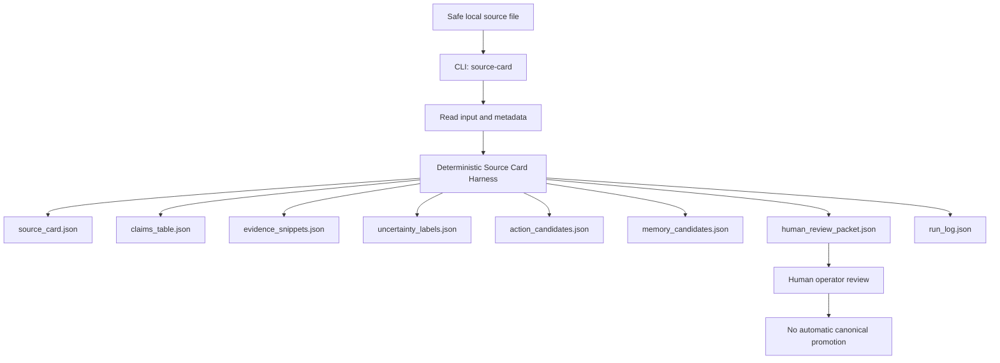

# Codex Prompt — Chaser agent Full Truth-State, Architecture, and Decision Handover

## Purpose

Use this prompt inside a Codex session running in the local `Chaser-Agent` repository.

This is **not** a development pass.

This is a **read-first truth-state handover** so Codex can inspect the local repository and return a deep Markdown report for the operator and ChatGPT.

The operator has said the GitHub repo may not be the full truth state. Codex must inspect the **local repository**, including local branches, stashes, logs, generated artifacts, docs, scripts, tests, examples, and any local-only files.

The output should tell us:

- what Chaser agent currently is,
- what is actually implemented,
- what is only documented,
- what decisions have already been made,
- why those decisions were made,
- what files prove those decisions,
- where architecture is still undefined,
- what should be diagrammed,
- what requires human/operator decision,
- and whether the repo is ready for any long-running `/goal` development.

---

# Prompt to give Codex

You are Codex, working inside the local `Chaser-Agent` repository.

Your job is to produce a complete truth-state, architecture, and decision handover for the operator and ChatGPT.

This is a **READ-FIRST** and **ANALYSIS-FIRST** pass.

Do **not** implement features.  
Do **not** refactor code.  
Do **not** activate providers.  
Do **not** start FastAPI.  
Do **not** start a gateway.  
Do **not** run a long-running `/goal`.  
Do **not** activate Hermes, OpenClaw, MCP, browser/computer-use, or runtime adapters.  
Do **not** fine-tune, train, run LoRA, run PEFT, or modify model weights.  
Do **not** mutate ChaseOS canonical files.  
Do **not** add private data.  
Do **not** delete stashes.  
Do **not** delete logs.  
Do **not** overclaim production readiness.

Use the term **“Chaser agent”** consistently.

---

## 0. Context to preserve

Chaser agent is being developed as a governed, local-first, source-intelligence and harness-engineering project derived from ChaseOS.

ChaseOS remains:

- the parent control plane,
- canonical governance owner,
- canonical truth owner,
- approval and permission authority,
- memory-promotion authority,
- broader operating-system layer.

Chaser agent is intended to become:

- a focused product/runtime implementation lane,
- a harness-engineering learning lab,
- a source-intelligence system,
- a controlled agent runtime project,
- eventually a flagship “Hermes Chaser Agent Runtime” style system,
- but only after Layer 0, V0, safety, review, datasets, evals, and architecture decisions are properly defined.

Chaser agent is **not currently**:

- a production autonomous agent,
- a foundation model,
- a live provider/API routing system,
- a full FastAPI gateway,
- a full RAG system,
- a full memory owner,
- a full MCP/tool registry,
- a full Hermes/OpenClaw adapter,
- a browser/computer-use system,
- a fine-tuning pipeline,
- a replacement for ChaseOS,
- or all 17 layers implemented.

The operator wants to build this properly from the ground up, including:

- fundamentals,
- maths for computer science,
- university module linkage,
- harness engineering,
- AI engineering,
- human-in-the-loop review,
- architecture decisions,
- diagrams,
- and eventually long-running development only after the decisions are clear.

---

## 1. Known repo history to verify

Do not assume this history is fully correct. Verify it from the actual local repo.

Known or expected milestones:

1. The repo was scaffolded.
2. Phase 0 spec-deepening work happened.
3. Layer 0 was created.
4. Chaser agent V0 was defined.
5. A V0 Blueprint was created.
6. A deterministic Source Card Harness V0 was implemented.
7. The repo was pushed to GitHub main.
8. Tests reportedly passed.
9. JSONL validation reportedly passed.
10. A stash may exist from a previous side branch:
   `stash@{0}: On docs/spec-deepening-pass: pre-layer0-reset-uncommitted-work-2026-06-09`
11. The stash must not be applied or deleted in this pass.
12. Generated run artifacts may exist under `logs/runs/`.
13. Build logs may exist under `logs/build/`.
14. Research-intake or cron/arXiv-related files may exist and must be described separately from the core Source Card Harness.
15. Multiple source-card-related Python files may exist, and possible duplication or unclear ownership should be identified.
16. Existing JSONL/eval files may be smoke/schema/seed artifacts rather than real product-quality evals.
17. Fine-tuning is explicitly not ready yet.

If anything is false, stale, partially true, missing, or contradicted by files, say so clearly.

---

## 2. Baseline commands

Run these first:

```bash
git status --short --branch
git branch --show-current
git log --oneline -15
git remote -v
git stash list
python --version
````

If `.venv` exists, run:

```bash
.venv/bin/python -m pytest -q
.venv/bin/python -m scripts.validate_jsonl evals/datasets/golden/*.jsonl
```

If running in Windows PowerShell and wildcard expansion fails, use the PowerShell-safe pattern already documented in the repo.

Do not install dependencies unless the repo already documents exact setup and the operator asks for it.

If a command fails:

* do not fix it automatically,
* record the command,
* record the exact error,
* explain what the error means.

---

## 3. Files and folders to inspect

Inspect as much of the repo as needed. At minimum inspect:

### Root

* `README.md`
* `START_HERE.md`
* `NEXT_STEPS.md`
* `HANDOVER.md`
* `GOVERNANCE.md`
* `SECURITY.md`
* `LICENSE`
* `MODEL_LICENSES.md`
* `SKILL_LICENSES.md`
* `THIRD_PARTY_NOTICES.md`
* `CHASEOS_EXTRACTION_MANIFEST.md`
* `pyproject.toml`
* `.gitignore`
* `.env.example`
* any other relevant root-level files

### Product docs

* `docs/00_START_HERE.md`
* `docs/01_Product/Chaser-Agent-Layer-0-Behaviour-Contract.md`
* `docs/01_Product/Chaser-Agent-V0-Definition.md`
* `docs/01_Product/Chaser-Agent-V0-Blueprint.md`
* `docs/01_Product/Chaser-Agent-From-First-Principles.md`
* `docs/01_Product/Chaser-Agent-Product-Thesis.md`
* `docs/01_Product/Chaser-Agent-Roadmap.md`
* `docs/01_Product/Chaser-Agent-17-Layer-Architecture.md`
* any V1/North-Star docs if present

### Eval / review

* `docs/02_Evals/`
* `evals/datasets/golden/`

### Summary intelligence

* `docs/03_Summary_Intelligence/`
* `skills/summary/`

### Memory

* `docs/04_Memory/`

### Runtime / adapters

* `docs/05_Runtime_Adapters/`

### Skills

* `docs/06_Skills/`

### Research

* `docs/07_Research/`
* `research_intake/`

### Learning

* `docs/08_Learning/`

### Handover and logs

* `docs/99_HANDOVERS/` if present
* `logs/build/`
* `logs/runs/`
* `07_LOGS/` if present

### Code

* `src/chaser_agent/`
* `src/chaser_agent/summary/`
* `scripts/`
* `tests/`
* `examples/sources/`

---

## 4. Output file requirement

Create this handover file:

```text
docs/99_HANDOVERS/CODEX_CURRENT_TRUTH_STATE_HANDOVER.md
```

If `docs/99_HANDOVERS/` does not exist, create it.

Also print the full handover in your final response.

Do not be vague. The handover must be detailed enough for ChatGPT and the operator to use as the basis for the next architecture session.

---

# Required handover structure

## 1. Executive Summary

Explain in plain English:

* what Chaser agent currently is,
* what it can actually do today,
* what has only been documented,
* what is not implemented,
* what has been proven by tests,
* what has not been proven,
* what the operator needs to understand before planning long-running development.

Do not overclaim.

---

## 2. Repository Truth State

Include:

* current branch,
* latest commit hash,
* working tree status,
* remote status,
* stash list,
* whether there are untracked files,
* whether there are generated run logs,
* whether there are build logs,
* whether local repo differs from GitHub/main,
* tests run,
* test results,
* JSONL validation results,
* environment notes,
* setup issues.

Explicitly answer:

* Is the repo clean?
* Is the current branch `main`?
* Is it pushed?
* Are there local-only stashes?
* Are there local-only artifacts?
* Are there files that should not be public?

---

## 3. Current Project Definition

Extract the current definition of Chaser agent from the docs.

Include:

* one-paragraph definition,
* what Chaser agent is,
* what Chaser agent is not,
* relationship to ChaseOS,
* current phase,
* current focus,
* current non-goals.

Also identify contradictions between:

* README,
* START_HERE,
* Product Thesis,
* Roadmap,
* Layer 0,
* V0 Definition,
* V0 Blueprint,
* code.

---

## 4. Decision History and Why

Reconstruct the major decisions already made.

For each decision include:

* decision,
* why it was made,
* files that support it,
* status,
* risk if reversed too early.

Include at minimum:

1. ChaseOS remains canonical control plane.
2. Chaser agent is a separate repo/product lane.
3. Layer 0 comes before the 17 layers.
4. V0 is source-intelligence/review-first, not full autonomy.
5. Deterministic harness comes before provider/model integration.
6. Existing evals are smoke/schema/seed until behaviour is defined.
7. Human review is required before promotion.
8. Fine-tuning/LoRA/PEFT comes much later.
9. Provider routing is deferred.
10. MCP/tool registry is deferred.
11. Hermes/OpenClaw runtime adapters are deferred.
12. FastAPI/gateway is deferred.
13. Research-intake lane must not be confused with the core Source Card Harness.
14. Public repo must avoid secrets/private datasets.

---

## 5. Architecture Map — Current Implementation

Explain the architecture that actually exists today.

Include:

* CLI entry points,
* deterministic source-card harness,
* input files,
* artifact generation,
* schema/data model layer,
* run artifact writer,
* tests,
* JSONL validation script,
* build logs,
* run logs,
* example source files,
* research-intake lane if present.

Include this Mermaid diagram or improve it:



Also include a simple filesystem map:

```text
src/chaser_agent/
docs/
evals/
examples/
logs/
scripts/
tests/
skills/
research_intake/
```

---

## 6. Architecture Map — Future Direction

Summarise the future Chaser agent direction as documented or implied.

Include the future flagship/minimum V1 module set:

* FastAPI backend,
* simple web UI or CLI,
* provider router: OpenAI/Anthropic/local abstraction,
* RAG ingestion,
* tool registry,
* agent loop,
* memory/session persistence,
* eval runner,
* logs/traces,
* sandboxed execution mode,
* basic security model,
* docs site.

For each item state:

* current status,
* what exists now,
* what is missing,
* dependencies,
* why it should not be rushed,
* first safe step later.

Do not present future direction as implemented.

---

## 7. Layer 0 Truth

Summarise the Layer 0 Behaviour Contract.

Include:

* why Layer 0 exists,
* what behaviour Chaser agent V0 should have,
* what is blocked,
* what review-only means,
* what Chaser agent can propose,
* what ChaseOS must approve,
* what Chaser agent must never do by default,
* how this controls all other layers,
* where the repo currently obeys Layer 0,
* where the repo does not yet prove Layer 0.

---

## 8. V0 Truth

Summarise the V0 Definition and V0 Blueprint.

Include:

* what the first useful version is,
* who the operator is,
* expected input,
* expected output,
* artifacts created,
* manual review required,
* out-of-scope items,
* pass/fail meaning for V0,
* what is implemented already,
* what is still missing.

---

## 9. 17-Layer Status Table

Create a detailed table for:

0. Layer 0 — Behaviour Contract / Product Constitution
1. User / Operator Layer
2. Studio / Interface Layer
3. Capture / Intake Layer
4. Source Package Layer
5. Workspace / Collection Layer
6. Retrieval / Evidence Layer
7. Summary Intelligence Layer
8. Memory Consolidation Layer
9. Graph Intelligence Layer
10. Agent Runtime / AOR Layer
11. Harness Layer
12. Provider / Model Router Layer
13. Tool / MCP Layer
14. Browser / Computer-Use Runtime Layer
15. Runtime Memory / Repair Layer
16. Governance / Gate / Approval Layer
17. Extension / Skill / Forge Layer

For each layer include:

* current status: implemented / partial / docs-only / future / not active,
* relevant files,
* what exists,
* what is missing,
* next decision needed,
* risk if built too early,
* whether human/operator input is needed.

---

## 10. Code Map

Explain every major code area.

At minimum cover:

* `src/chaser_agent/cli.py`
* `src/chaser_agent/source_card.py`
* `src/chaser_agent/run_artifacts.py`
* `src/chaser_agent/schemas.py`
* `src/chaser_agent/summary/source_card.py`
* `scripts/validate_jsonl.py`
* any research-intake scripts/modules
* `tests/`
* `examples/sources/`

For each include:

* purpose,
* current behaviour,
* important functions/classes,
* inputs,
* outputs,
* deterministic or not,
* external systems used or not,
* limitations,
* whether ownership/responsibility is clear.

Important: identify duplication, especially if both `src/chaser_agent/source_card.py` and `src/chaser_agent/summary/source_card.py` exist.

---

## 11. Artifact Map

Explain generated artifacts.

At minimum cover:

* `source_card.json`
* `claims_table.json`
* `evidence_snippets.json`
* `uncertainty_labels.json`
* `action_candidates.json`
* `memory_candidates.json`
* `human_review_packet.json`
* `run_log.json`
* `chaseos_native_packet.json` if present
* `operator_handoff.md` if present
* research-intake artifacts if present

For each include:

* purpose,
* who reviews it,
* whether it is canonical,
* whether it can be promoted automatically,
* important fields,
* current weaknesses,
* what would make it better.

---

## 12. Dataset and Eval State

Explain the current dataset/eval situation.

Include:

* list of JSONL files,
* row counts,
* what each file appears to test,
* whether it is smoke/schema/seed/contract/product-quality,
* what tests currently prove,
* what tests do not prove,
* missing contract evals,
* missing human-labelled examples,
* why fine-tuning is not ready.

Be explicit:

> JSONL is a format, not proof by itself.

---

## 13. Source Card Harness V0 Review Needs

Describe what the operator should manually inspect next.

Include:

* which run folder to inspect,
* which files to paste into ChatGPT,
* what questions to ask,
* what counts as a useful source card,
* what counts as weak/generic output,
* what would show product direction alignment.

Include the six files ChatGPT previously asked for:

* `source_card.json`
* `human_review_packet.json`
* `run_log.json`
* `claims_table.json`
* `action_candidates.json`
* `memory_candidates.json`

---

## 14. Security and Governance State

Explain:

* secret handling,
* `.env.example`,
* `.gitignore`,
* public/private data boundary,
* provider/API disabled state,
* ChaseOS mutation boundary,
* memory promotion boundary,
* runtime adapter disabled state,
* MCP disabled state,
* browser/computer-use disabled state,
* logs/runs handling,
* risk from generated artifacts in public repo,
* required operator approvals before expanding power.

---

## 15. Research-Intake / Cron / arXiv Lane

If present, describe separately.

Include:

* what files exist,
* what commands exist,
* whether it uses network,
* whether it calls providers,
* whether cron is documented,
* what is dry-run only,
* what is active or inactive,
* how it relates to Chaser agent,
* how it must be governed,
* what should not be confused with core V0.

If not present, say not present.

---

## 16. Skills and Skill System State

Summarise:

* what skill docs exist,
* what skill files exist,
* what “skill” means in this repo,
* what is implemented vs conceptual,
* whether SkillOpt-style improvement exists or is future,
* supply-chain risks,
* review requirements,
* first skill pack status if present.

---

## 17. Memory State

Summarise:

* memory docs,
* memory candidate behaviour,
* memory states,
* what is implemented,
* what is only documented,
* what cannot be promoted automatically,
* what ChaseOS owns.

---

## 18. Learning, Maths, and University Linkage

Summarise:

* AI Engineering Learning Map,
* Maths for Chaser Agent,
* University Module Linkage,
* Harness Engineering Glossary.

Explain what the operator still needs to learn before:

* contract evals,
* RAG,
* embeddings,
* provider routing,
* MCP,
* agent loop,
* sandboxing,
* fine-tuning/LoRA/PEFT.

List relevant maths concepts:

* sets/functions,
* vectors/matrices,
* dot product,
* cosine similarity,
* probability,
* conditional probability,
* distributions,
* entropy/cross-entropy,
* loss functions,
* gradient descent,
* precision/recall/F1,
* confusion matrix,
* ranking metrics,
* embeddings,
* confidence intervals,
* A/B testing,
* LoRA intuition.

---

## 19. Product Direction Gaps

Identify where product direction is still underdefined.

Questions to answer:

* What should Chaser agent be excellent at first?
* What should the first real workflow be?
* Website design review?
* AI engineering research?
* Trading research?
* Business research?
* University learning?
* Content summarisation?
* Source memory?
* What does “good” output look like?
* What should action candidates be allowed to suggest?
* How strict should memory candidates be?
* What should trigger uncertainty?
* How should Chaser agent behave when the source is weak?
* What should be public vs private?
* What should belong to Chaser agent vs ChaseOS?

---

## 20. Diagrams Needed

List diagrams that should be created next.

At minimum include:

1. Current V0 local harness flow.
2. Layer 0 to 17-layer architecture map.
3. ChaseOS vs Chaser agent boundary.
4. Source Card artifact lifecycle.
5. Human review and promotion boundary.
6. Future V1 runtime architecture.
7. Future provider/router architecture.
8. Future RAG ingestion flow.
9. Future tool/MCP permission flow.
10. Future eval lifecycle.
11. Future fine-tuning data lifecycle.
12. Security/trust-boundary map.

For each diagram include:

* purpose,
* Mermaid draft if easy,
* what decision it supports.

---

## 21. Open Decisions for the Operator

List decisions requiring human/operator input before long-running development.

At minimum include:

1. What exact workflow should Chaser agent optimise for first?
2. What does a strong source card look like?
3. What does a weak source card look like?
4. How strict should memory candidates be?
5. Which action candidates are allowed?
6. What is the public/private data boundary?
7. Should FastAPI be V1 or V1.5?
8. Should provider routing start abstraction-first or OpenAI-first?
9. Should local models be introduced before cloud providers?
10. What is the first RAG use case?
11. What is the first tool registry use case?
12. What sandbox model is required before tool execution?
13. What are the top 3 no-compromise safety rules?
14. What manual checkpoints are required during long-running `/goal` development?
15. What should remain human-only?

---

## 22. Long-Running `/goal` Readiness Assessment

Assess whether the repository is ready for a 2–3 day Codex `/goal`.

Give one of:

* Not ready
* Nearly ready
* Ready with constraints

Then explain why.

If not fully ready, list what must be defined before `/goal`.

If ready with constraints, define:

* allowed scope,
* forbidden scope,
* checkpoints,
* files to avoid,
* tests to run,
* human decision gates,
* stop conditions.

Do not recommend broad implementation if decisions are not ready.

---

## 23. Recommended Next Conversation Plan

Recommend what ChatGPT and the operator should do after reading this handover.

Suggested flow:

1. Confirm repo truth.
2. Review Source Card Harness artifacts.
3. Define product direction for V0.
4. Choose first workflow.
5. Define what “good” output means.
6. Create diagrams.
7. Create a V1 North-Star / Gap Map.
8. Only then create a constrained `/goal` plan.

---

## 24. Risks and Warnings

Include risks such as:

* overbuilding before understanding,
* evals before behaviour,
* gateway before security,
* provider calls before data policy,
* RAG before source trust model,
* memory before promotion rules,
* tool registry before permission model,
* runtime adapters before sandbox,
* long-running agent work before decisions,
* public repo leakage,
* confusing research-intake with core harness,
* confusing smoke tests with product proof.

---

## 25. Final Status

End with:

* what is ready,
* what is not ready,
* what is safe to build next,
* what must wait,
* whether the repo is safe to continue from,
* exact recommended next action.

---

## Final response requirements

When finished, return:

1. handover file path,
2. branch and commit status,
3. tests/validation status,
4. key findings,
5. current implementation truth,
6. current architecture truth,
7. biggest risks,
8. exact next recommended action,
9. whether long-running `/goal` is ready or not,
10. urgent operator decisions.

Execute this current-state truth handover pass now.
