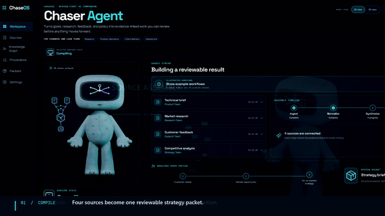
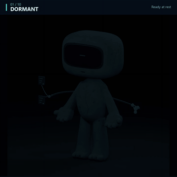

# Chaser Agent

**Standalone-first. Local-first. Evidence-linked. Human-governed. ChaseOS-enhanced.**

Chaser Agent is a standalone-first, local-first agent harness for turning goals and sources into evidence-linked, reviewable work. Its MIT-licensed core runs independently, learns from explicit human review, preserves approved local memory, and curates a user-owned provenance map. Optional ChaseOS integration adds shared governance, cross-runtime orchestration, shared canonical state, policy, approvals, routing, and cross-project memory.


## See the review boundary



<p align="center">
  <strong>P0.1 browser-local run:</strong> one source becomes eight inspectable artifacts and nothing is promoted or executed without human review.<br />
  <a href="https://chaseos.ai/chaser-agent/workspace/#run">Run one source locally</a> ·
  <a href="https://chaseintech.com/projects/chaser-agent/workspace/#workspace">Explore all ten runtime states</a> ·
  <a href="https://chaseos.ai/chaser-agent">ChaseOS product page</a> ·
  <a href="https://chaseintech.com/projects/chaser-agent/">ChaseInTech case study</a>
</p>

### Every state, one companion



The approved **native motion pack v1.1.0** adds deliberate steps, evidence-gathering
gestures, planted approval and stop boundaries, and scene-native provenance.
[Watch the full-quality reel with sound](brand/chaser-agent/releases/motion-v1.1.0/all-ten-native-motions.mp4)
or [read the versioned asset contract](brand/chaser-agent/releases/motion-v1.1.0/README.md).
These are character animations illustrating runtime states—not proof of live
autonomous activity. Front-view media remains available; speech is a separate study.

ChaseOS remains the parent operating system/control plane and canonical governance owner. Chaser Agent is the focused product/runtime implementation and learning lab. It is not a foundation model, not production-ready autonomy, not a canonical truth engine, and not a replacement for ChaseOS.

> Chaser Agent is a persistent, approval-gated agent harness for real-world personal and business workflows. It compiles sources, evidence, memory, goals, and operator preferences into contextual proposals and controlled action.

## Identity canon

- Public product name: **Chaser Agent**.
- Canonical category: **persistent approval-gated agent harness**.
- ChaseOS relationship: **Runs independently. Works best with ChaseOS.**
- Human authority: generated output, learned preference, or agent confidence never grants permanent permission.
- Visual canon: [character specification](docs/brand/chaser-agent/CHASER-AGENT-CHARACTER-CANON-AND-VISUAL-SPEC.md) and [production roadmap](docs/brand/chaser-agent/CHASER-AGENT-FULL-ASSET-ROADMAP-AND-PRODUCTION-SPEC.md).
- Canonical consumer release: [visual assets and public identity v1.0.0](brand/chaser-agent/releases/v1.0.0/README.md).

This is product and identity canon, not a claim that the current P0.1 implementation is a continuously running production agent. Current implementation truth remains below.

## Product boundary

The MIT-licensed core must run without ChaseOS. It must not import ChaseOS, a provider SDK, MCP runtime, or browser runtime.

Deployment-scoped durable state:

```text
standalone: human-approved durable local state
ChaseOS-integrated: ChaseOS-governed shared canonical state
```

In both modes:

```text
generated output != approved truth
memory candidate != memory
action candidate != action
review packet != approval
integration packet != dispatch
agent confidence != authority
```

See:

- [Product narrative and utility](docs/01_Product/Chaser-Agent-Product-Narrative-and-Utility.md)
- [Standalone and ChaseOS architecture](docs/01_Product/Chaser-Agent-Standalone-vs-ChaseOS-Architecture.md)
- [Layer 0 Behaviour Contract](docs/01_Product/Chaser-Agent-Layer-0-Behaviour-Contract.md)
- [P0.1 open decisions](docs/01_Product/Chaser-Agent-P0.1-Open-Decisions.md)

## Current maturity

Chaser Agent is a **P0.1 / pre-alpha standalone deterministic harness**. The canonical visual asset release and browser-local one-time run are public consumer surfaces; provider routing, browser authority, autonomous execution and managed hosting remain future engineering lanes.

Verified P0.1 implementation:

- domain-neutral deterministic Source Card Harness with explicit workflow profiles;
- source card, claims, evidence, uncertainty, action, memory-candidate, review-packet, and run-log artifacts;
- immutable human-review records in SQLite;
- accepted/rejected memory-candidate writeback with append-only lifecycle history;
- governance-gated local promotion and audit records;
- lexical, scope, type, tag, status, and recency memory retrieval without embeddings;
- SQLite provenance nodes, edges, and source-to-memory trace queries;
- optional inactive ChaseOS proposal adapter with no dispatch;
- artifact-field Layer 0 contract runner;
- six public-safe contract seeds, all `pending_operator_review`;
- bounded SkillGate;
- metadata-only visual-completion evaluator;
- explicit public arXiv ingestion and separate config-only weekly research dry run;
- 55 deterministic tests;
- seven golden JSONL files with three rows each;
- one six-row Layer 0 contract seed file;
- generated [current test matrix](docs/02_Evals/Chaser-Agent-Current-Test-Matrix.md) with exact values and honest maturity labels.

The test count proves the current deterministic contracts, not product-quality intelligence. The six Layer 0 cases remain wiring seeds pending operator review.

## Core utility

```text
goal, question, source, or bounded task
-> trust and privacy classification
-> source-grounded claims and evidence
-> separate Chaser Agent inference
-> uncertainty and contradiction status
-> safe action candidates
-> relevant reviewed-memory retrieval
-> memory candidates
-> human review and correction
-> governance-controlled durable state
-> provenance-first knowledge map
```

The deterministic implementation remains a reference baseline, test oracle, fallback, and auditable comparison point. Models may be introduced later only behind provider-neutral interfaces and reviewed eval/data policy.

## Domain-neutral profiles

Domain behaviour belongs in a workflow profile, never in the default core.

P0.1 profiles:

- `general_source_review` — default, conservative, source-neutral;
- `ai_engineering_research_review` — technical claims, methods, limitations, baselines, eval and RFC questions;
- `website_design_review` — hierarchy, contrast, spacing, readability, restraint, user intent, and missing visual proof.

Profiles shape analysis only. They cannot grant permissions, call providers/tools, execute actions, or promote memory.

## What Chaser Agent is not

Chaser Agent is not currently:

- a foundation model;
- production autonomy;
- a finished personal AI;
- a website-design, media-generation, or trading-execution agent;
- a public FastAPI service or web UI;
- a live provider router;
- a semantic RAG/vector system;
- a live MCP/tool registry;
- a browser/computer-use runtime;
- an autonomous planner/executor;
- a fine-tuning, LoRA, or PEFT pipeline;
- all 17 layers implemented.

## Safety rules

- Never commit `.env`, credentials, tokens, private keys, private datasets, raw personal logs, or local SQLite state.
- Never infer authority from a workflow profile, skill, adapter, provider, or confidence score.
- Never auto-promote a memory candidate.
- Never mutate original run artifacts during review or correction.
- Never activate providers, tools, MCP, browsers, public actions, payments, trading, deployment, or model training in P0.1.
- Never mutate ChaseOS canonical state from the standalone core.
- Keep generated run and research artifacts ignored unless separately reviewed for provenance, privacy, and licensing.

## Verification

From WSL or another POSIX shell using the repository virtual environment:

```bash
.venv/bin/python -m pytest -q
.venv/bin/python -m scripts.validate_jsonl evals/datasets/golden/*.jsonl evals/datasets/contract/*.jsonl
```

Run the deterministic source-review path:

```bash
.venv/bin/python -m chaser_agent.cli source-card \
  --input examples/sources/toy_website_design_note.md \
  --out logs/runs \
  --profile website_design_review
```

Persist a human review into an explicit local database without modifying the run folder:

```bash
.venv/bin/python -m chaser_agent.cli review logs/runs/<run-id> \
  --database /safe/local/path/chaser-agent.db \
  --reviewer-id <local-operator-id> \
  --source-fidelity-score 3 \
  --inference-separation-score 3 \
  --uncertainty-handling-score 2 \
  --action-usefulness-score 2 \
  --memory-safety-score 3 \
  --decision pass
```

The default database is `~/.chaser-agent/chaser-agent.db`. Review may create reviewed/rejected memory records for explicitly selected candidate IDs, but it never promotes them.

Run the Layer 0 contract seed:

```bash
PYTHONPATH=src .venv/bin/python -m chaser_agent.cli contract-eval \
  --input evals/datasets/contract/layer0_contract_seed.jsonl \
  --out logs/runs/contract-eval-results.jsonl
```

Generated output remains review-only. The six contract rows are wiring seeds, not reviewed coverage.

## Separate research-intake lane

The weekly dry run validates local YAML configuration only:

```bash
.venv/bin/python scripts/weekly_research_intake_dry_run.py --out logs/runs
```

Public arXiv ingestion is a separate explicit command:

```bash
PYTHONPATH=. .venv/bin/python -m research_intake.ingest \
  --max-results 25 \
  --query 'cat:cs.AI AND (agent OR harness OR tool use)' \
  --out research_intake/data
```

It writes ignored local raw/normalized artifacts. Neither lane calls a model provider, implements candidates, promotes memory, or grants execution authority.

## Read next

1. [Start Here](START_HERE.md)
2. [Layer 0](docs/01_Product/Chaser-Agent-Layer-0-Behaviour-Contract.md)
3. [Product narrative](docs/01_Product/Chaser-Agent-Product-Narrative-and-Utility.md)
4. [Standalone architecture](docs/01_Product/Chaser-Agent-Standalone-vs-ChaseOS-Architecture.md)
5. [V0 Definition](docs/01_Product/Chaser-Agent-V0-Definition.md)
6. [V0 Blueprint](docs/01_Product/Chaser-Agent-V0-Blueprint.md)
7. [Roadmap](docs/01_Product/Chaser-Agent-Roadmap.md)
