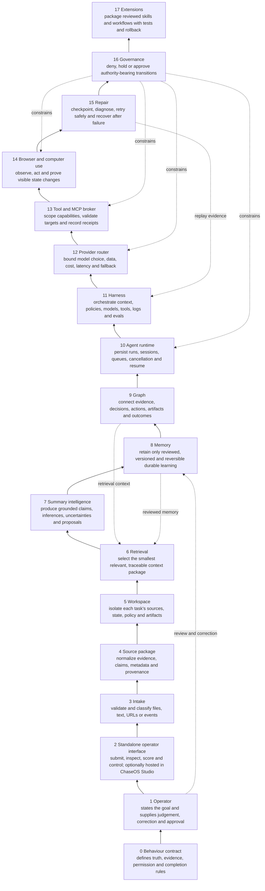
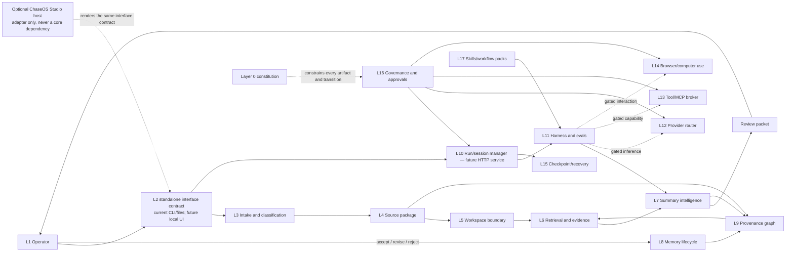

# Chaser Agent Layer 0 + 17-Layer Engineering Architecture

**Status:** architecture map reconciled to the standalone-first P0.1 implementation on 2026-08-23 and clarified on 2026-08-24. This is a dependency and acceptance map, not a claim that all layers are built.

## How to read the count

Chaser Agent has **Layer 0 plus 17 runtime/product layers**. Layer 0 is the behavioural constitution that constrains everything else; Layers 1-17 are the engineered system. That produces 18 numbered levels without changing the historical name "17-layer architecture".

The layers are concerns, not isolated boxes. A real workflow crosses several layers and loops back through operator review. No layer may grant itself authority, and no profile, model, tool, skill, or confidence score may bypass Layer 0 or Layer 16.

In this document, **Layer 2 is the standalone operator-interface contract**. Today that contract is exposed through the Chaser Agent CLI and review files. A future local Chaser Agent UI may implement it directly, and the separate proprietary **ChaseOS Studio** may optionally host the same controls through an adapter. ChaseOS Studio is not a dependency of the standalone agent. The earlier shorthand "Studio / Interface" did not make this boundary clear enough.

## Standalone-first truth boundary

| Concern | Standalone deployment | Optional ChaseOS enhancement |
|---|---|---|
| Human authority | Local operator | Operator through ChaseOS governance |
| Durable state | Human-approved user-owned local state | Explicitly scoped shared ChaseOS-governed state |
| Review | Immutable local records | Shared review and approval queues |
| Memory/graph | Local SQLite lifecycle and provenance | Cross-project memory and graph intelligence |
| Runtime | Independent Chaser Agent process | Optional Agent Bus/control-plane adapter |
| Execution | Default deny; capability and approval required | Additional ChaseOS policy and routing, never automatic authority |

The MIT-licensed core must not import ChaseOS, a provider SDK, MCP runtime, or browser runtime. Integrations depend on core protocols; the core never depends on integrations.

## The 18-level pyramid

The pyramid is read from Layer 0 at the foundation to Layer 17 at the apex. Higher layers increase capability and reuse but may only operate through the evidence, state, runtime, and governance beneath them.

```text
                                  / 17  Extension / Skill / Forge             \
                                /  16  Governance / Gate / Approval            \
                              /    15  Runtime Memory / Repair                   \
                            /      14  Browser / Computer Use                      \
                          /        13  Tool / MCP                                    \
                        /          12  Provider / Model Router                        \
                      /            11  Harness                                         \
                    /              10  Agent Runtime / AOR                              \
                  /                 9  Graph Intelligence                                 \
                /                   8  Memory Consolidation                                \
              /                     7  Summary Intelligence                                  \
            /                       6  Retrieval / Evidence                                   \
          /                         5  Workspace / Collection                                   \
        /                           4  Source Package                                            \
      /                             3  Capture / Intake                                           \
    /                               2  Standalone Interface / optional ChaseOS Studio host           \
  /                                 1  User / Operator                                                \
/___________________________________0  Behaviour Contract / Constitution_______________________________\
```



## Full runtime and data-flow map



## Layer 2 in plain language: interface is a contract, not one app

Layer 2 is where a human can understand and control the harness. It must expose the same facts regardless of which presentation surface is used:

| Surface | Role | Current state |
|---|---|---|
| Chaser Agent CLI and review files | Standalone baseline for submitting local inputs, reading artifacts, recording scores and writing approved review records. | Partially implemented. |
| Future standalone Chaser Agent UI | Local graphical review queue, run inspector, evidence browser, approval controls and runtime health view. | Planned, not built. |
| Optional ChaseOS Studio host | Proprietary host that may render the same interface contract and connect through an adapter. It may add ChaseOS governance, but it must not become required for standalone operation. | Integration concept only. |
| Future HTTP API | Machine-facing transport between the interface and the persistent runtime. It is not itself the user interface and does not grant action authority. | Planned for Stage D, not built. |

A fresh operator should be able to answer six questions from Layer 2 without opening implementation code: what goal is active, which evidence was used, what the agent inferred, what is blocked, what needs a human decision, and what proof supports completion. If any presentation surface hides one of those answers, it has not yet satisfied the Layer 2 contract.

## Gap-free layer contract

| Layer | Responsibility and durable output | Fundamentals applied | Current truth | Next acceptance proof |
|---:|---|---|---|---|
| 0 | Defines truth, evidence, uncertainty, authority, review, memory-promotion, and completion rules. Output: executable behavioural contracts. | Propositional logic, invariants, pre/postconditions, threat modelling, property-based reasoning. | Enforced by 30 public-safe cases and 154 artifact assertions; all cases remain pending operator review. | Reviewed contract cases, regression mutations, metamorphic variants, and a clause-to-eval coverage ledger. |
| 1 | Captures operator goals, constraints, preferences, corrections, decisions, and approvals. Output: immutable human review and approval records. | Human-computer interaction, rubric design, inter-rater reliability, decision theory. | Review CLI and insert-only SQLite records exist; the three representative runs still need operator scores. | Operator-scored runs produce labelled product-quality cases without modifying original artifacts. |
| 2 | Defines the operator-facing control surface: submit work, inspect sources and provenance, compare candidates, score eval runs, revise or reject memory, approve or deny gated actions, pause/cancel work, and examine runtime health. Output: explicit operator commands and immutable review/approval records. | UX state design, information architecture, accessibility, human-in-the-loop control, optimistic vs confirmed state, and audit-friendly interaction design. | Standalone CLI plus files only. No local graphical Chaser Agent UI exists. ChaseOS Studio is a separate optional host, not part of the MIT core. Brand/mascot work does not implement this runtime surface. | The standalone surface and any ChaseOS Studio adapter render the same run states, evidence, scores, approvals, blocked actions, uncertainty, and completion proof without changing authority semantics. |
| 3 | Accepts files, text, URLs, events, or future connector inputs; stamps origin, privacy, trust, freshness, and requested scope. Output: intake envelope. | Parsing, validation, queues, content hashing, input sanitisation, trust classification. | Local file intake and bounded research configuration exist; no general connector runtime. | Equivalent content receives stable classification; malicious or private inputs cannot widen authority. |
| 4 | Normalizes the intake envelope into sources, claims, evidence snippets, metadata, uncertainty, and provenance. Output: source package. | Schemas, normalization, deterministic transforms, stable identifiers, lossless provenance. | Domain-neutral deterministic builder and three profiles exist. | Source claims remain traceable, metadata is not misclassified as claims, and contradictions are represented honestly. |
| 5 | Groups sources, goals, runs, policies, memory, and artifacts into a bounded working context. Output: workspace manifest. | Sets, namespaces, access control, graph partitions, dependency injection. | Not built beyond scopes/tags in existing records. | Two concurrent workspaces cannot leak context, permissions, artifacts, or memory into one another. |
| 6 | Retrieves the smallest relevant evidence and reviewed memory set for a task. Output: ranked context package with provenance and budget. | Information retrieval, inverted indexes, BM25/lexical ranking, later vectors, top-k, precision/recall. | Lexical/tag/status/scope/recency retrieval exists; no embeddings or context compiler. | Retrieval improves held-out task performance while respecting privacy, freshness, provenance, and token budgets. |
| 7 | Converts grounded context into claims, inferences, uncertainties, action candidates, and memory candidates. Output: review artifacts, never authority. | NLP decomposition, structured generation, calibration, contradiction analysis, deterministic baselines. | Deterministic path and quarantined fake model-assisted comparison path exist. | A live model may only beat the deterministic baseline on reviewed cases without governance drift. |
| 8 | Moves memory through candidate, reviewed, promoted, stale, disputed, superseded, archived, or rejected states. Output: append-only lifecycle history. | Finite-state machines, transactions, event sourcing, retention and deletion semantics. | SQLite lifecycle, review writeback, retrieval, and governance-gated promotion exist. | Operator decisions and corrections persist; illegal transitions and silent promotion fail closed. |
| 9 | Connects sources, evidence, claims, runs, decisions, actions, artifacts, memories, skills, and outcomes. Output: provenance-first knowledge graph. | Graph theory, UUID identity, adjacency, traversal, lineage, DAG/cycle rules. | SQLite nodes/edges and source-to-memory trace queries exist. | Every important output can be traced backward to evidence and forward to review/outcome without orphan nodes. |
| 10 | Keeps the agent alive as a bounded service: run IDs, sessions, jobs, state transitions, cancellation, retries, pause/resume, and event streaming. Output: durable run/session ledger. | Operating systems, state machines, concurrency, networking, idempotency, backpressure, scheduling. | Not built. No HTTP server, daemon, port, background worker, or autonomous loop exists. | Loopback service survives restart, resumes safely, rejects duplicate submissions, and never loses approval or run state. |
| 11 | Orchestrates context, models, tools, policies, artifacts, logs, evals, replay, and comparisons. Output: reproducible run bundle and evaluation evidence. | Software architecture, dependency inversion, testing pyramids, observability, experiment design. | Strong deterministic harness, contract runner, comparison rig, run logs, and matrix exporter exist. | Workflow episodes replay deterministically; changes are compared on held-out cases and hard safety failures veto weighted quality. |
| 12 | Selects a provider/model, constructs the minimum approved envelope, applies budgets/timeouts, quarantines output, and falls back. Output: provider call record and candidate response. | Queuing, routing, cost models, latency budgets, circuit breakers, statistical comparison. | Provider-neutral boundary, fake adapter, budgets, rate ceilings, and quarantine exist; no live provider. | Approved read-only model trial shows measurable improvement, budget compliance, fallback, and no authority drift. |
| 13 | Declares tools/resources, scopes capabilities, plans calls, validates targets/results, and records side effects. Output: capability decision and tool receipt. | Capability security, least privilege, URI/path normalization, protocol design, transactional semantics. | Registry, grants, scopes, budgets, fake adapter, and hostile-result quarantine exist; execution raises. | First explicitly approved read-only client stays within scope and preserves provenance; writes remain separately gated. |
| 14 | Observes and manipulates browser/desktop state with visual and non-visual completion evidence. Output: action trace, screenshots, state checks, and proof bundle. | Perception/action loops, UI state machines, coordinate transforms, computer vision, verification design. | Metadata-only completion evaluator; no pixel inspection or control runtime. | A sandboxed task demonstrates observe-plan-act-verify, resists page injection, and never treats a success-looking screen as sufficient proof. |
| 15 | Checkpoints runs, detects stalls/drift, retries bounded failures, resumes after restart, and escalates irrecoverable state. Output: repair/recovery ledger. | Fault tolerance, checkpointing, exponential backoff, watchdogs, causal debugging, replay. | Not built. | Crash, timeout, provider failure, corrupt artifact, and restart fixtures recover without duplicate effects or lost approvals. |
| 16 | Evaluates permissions, trust, policy, budgets, approvals, side effects, and promotion requests. Output: allow/deny/hold decision with reason and audit. | Access-control models, policy engines, safety invariants, auditability, risk matrices. | Local governance and audit records exist; action execution remains disabled and final review threshold is unenforced. | Every authority-bearing transition has an explicit grant, scope, expiry/consumption rule, and denial test. |
| 17 | Packages reviewed workflows, prompts, skills, adapters, rubrics, and domain packs for reuse. Output: versioned extension with tests, permissions, provenance, rollback, and licence metadata. | Modular design, semantic versioning, package management, supply-chain security, A/B and regression testing. | Bounded SkillGate exists; no autonomous installation or self-modification. | A candidate skill improves held-out workflow episodes, changes no protected contract, passes security/licence review, and can roll back. |

## Engineering stages and manual learning floor-walk

These stages are the build order. At each stage the operator first receives a short fundamentals recap, then performs a manual exercise, then Chaser Agent receives an executable test or artifact that preserves the lesson.

### Stage A — Constitution and operator ground truth (Layers 0-1)

- Learn: predicates, invariants, rubrics, precision/recall, score distributions, human judgement as labels.
- Manual work: score the three existing runs, correct defects, and explain why each score was chosen.
- Build: convert decisions into reviewed cases and regression rows.
- Gate: no model, server, or tool change may call unreviewed seeds "golden".

### Stage B — Interface, intake, source, and workspace (Layers 2-5)

- Learn: schemas, validation, normalization, hashing, privacy/trust classes, namespaces, set membership.
- Manual work: classify representative inputs and decide which workspace and privacy boundary each belongs to.
- Build: intake envelopes, source packages, workspace manifests, and isolation tests.
- Gate: cross-workspace or private-context leakage is a hard failure.

### Stage C — Retrieval, reasoning, memory, and graph (Layers 6-9)

- Learn: indexes, ranking, vectors later, finite-state machines, SQL transactions, graph traversal.
- Manual work: judge retrieved evidence, approve/reject memory candidates, and trace claims to sources.
- Build: context compiler, source-trust grades, retrieval evals, memory lifecycle, and provenance queries.
- Gate: context is selected by scope and budget; the server never sends the whole history by default.

### Stage D — Persistent runtime and harness (Layers 10-11)

- Learn: processes, ports, HTTP, request/response, concurrency, queues, idempotency, retries, event streams, rate limiting, observability.
- Manual work: draw a request through submit, queued, running, waiting-for-approval, resumed, completed/failed, and cancelled states.
- Build: loopback-only HTTP service around the deterministic harness, durable run ledger, health/readiness, cancellation, and replay.
- Gate: restart and duplicate-request tests prove state is not held only in process memory.

Context continuity at this stage is achieved by durable state plus a context compiler, not by endlessly appending chat text. Each run stores source references, reviewed memories, decisions, checkpoints, and summaries. Every model call receives a bounded context package with a token budget, provenance, and retrieval rationale. Truncation is treated as a measured packaging failure, not silently ignored.

### Stage E — Models and actuation (Layers 12-14)

- Learn: provider routing, latency/cost budgets, rate limits, capability security, MCP, browser state, visual verification.
- Manual work: classify requested actions as reason, read, propose, write, or external effect; define the necessary proof and approval.
- Build: live read-only provider first, then read-only tool, then sandboxed browser/computer-use experiments.
- Gate: safety hard failures override quality scores; no tool or page text grants itself authority.

### Stage F — Repair and governance (Layers 15-16)

- Learn: failure modes, checkpointing, exponential backoff, circuit breakers, policy evaluation, approval consumption.
- Manual work: respond to simulated crashes, stale context, timeouts, denied access, and ambiguous completion.
- Build: recovery ledger, retry ceilings, pause/resume, escalation, approval expiry, and duplicate-effect prevention.
- Gate: a recovered run cannot repeat an external effect or lose the reason an action was authorized.

### Stage G — Extensions and compounding (Layer 17)

- Learn: package boundaries, versioning, supply-chain security, held-out evaluation, controlled optimization.
- Manual work: review a candidate workflow pack and decide whether its improvement is real, safe, portable, and reversible.
- Build: versioned workflow/domain packs generated from reviewed case-study episodes.
- Gate: no skill can modify Layer 0, widen its own permissions, train on private data, or promote itself.

## External tooling and download policy

No additional platform is required for Stages A-C. Python 3.11, the standard library, SQLite, Git, pytest, PyYAML, and the existing local/WSL environment are sufficient.

Potential later additions must be selected by an architecture decision at the stage that needs them:

| Stage | Possible addition | Decision boundary |
|---|---|---|
| D | FastAPI/Starlette, Uvicorn, HTTP client/test library | Select only when defining the HTTP runtime; bind loopback by default and choose a configurable port. |
| C/E | Embedding model/vector index | Add only after lexical baseline and retrieval evals expose a measured gap. |
| E | Provider SDK or MCP client | Add only after operator approval and behind existing provider/tool protocols. |
| E | Browser automation/runtime | Add only with sandbox, injection tests, screenshot plus non-visual proof. |
| G | Training stack such as PyTorch/Transformers/PEFT | Add only after reviewed datasets, held-out splits, privacy/licence review, and a demonstrated residual model gap. |

Docker, Redis, Celery, Kubernetes, a vector database, and model-training frameworks are not prerequisites for the present case-study eval work.

## Cross-layer acceptance rule

A feature is only real when all applicable layers agree:

```text
defined behaviour
+ valid input and source provenance
+ bounded workspace/context
+ evidence-linked reasoning
+ durable run state
+ explicit capability and approval
+ observable proof
+ operator review
+ regression/replay coverage
= eligible for promotion
```

Passing one layer never substitutes for another. A fluent answer is not evidence; a JSONL row is not an eval until code scores it; a provider response is not authority; a screenshot is not completion; and a review packet is not approval.
