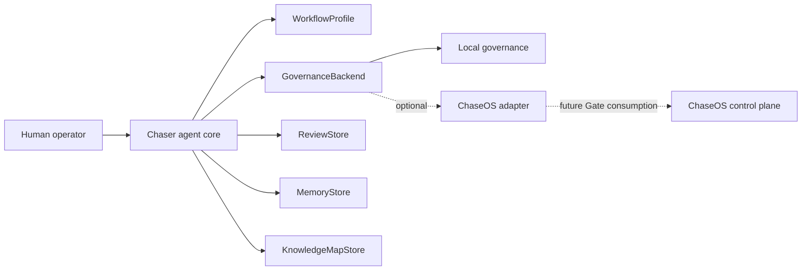

# Chaser agent Standalone and ChaseOS-Integrated Architecture

**Status:** APPROVED P0.1 architecture; implementation tracked on `codex/standalone-first-memory-realignment`.

## Product rule

Chaser agent is standalone-first and ChaseOS-enhanced. A user must be able to install the MIT-licensed core, run deterministic source review, record human review, persist approved local memory, and query a local provenance map without installing ChaseOS.

ChaseOS remains the strongest optional integration for shared governance, cross-runtime orchestration, shared canonical state, policy, approvals, routing, and cross-project memory. Integration adds capability; it does not define whether the Chaser agent core can run.

## Deployment-scoped durable state

| Deployment | Human authority | Durable state | Integration boundary |
|---|---|---|---|
| Standalone | Local human operator | Human-approved durable local state | Local governance, review, memory, and knowledge-map adapters |
| ChaseOS-integrated | Human operator through ChaseOS governance | ChaseOS-governed shared canonical state, plus any explicitly scoped local state | Optional inactive-by-default ChaseOS adapter |

In both deployments:

```text
generated output != approved truth
memory candidate != memory
action candidate != action
review packet != approval
integration packet != dispatch
agent confidence != authority
```

## Dependency inversion



The core depends on protocols. Local and ChaseOS-specific implementations depend on those same protocols.

Allowed:

```text
core -> protocols
local adapters -> protocols
optional ChaseOS adapter -> protocols
```

Forbidden:

```text
core -> ChaseOS
core -> provider SDK
core -> MCP runtime
core -> browser runtime
```

## P0.1 package boundary

```text
src/chaser_agent/
  core/             domain-neutral review models and deterministic extraction
  workflows/        non-authorising workflow profiles
  governance/       protocol plus standalone local policy
  reviews/          immutable operator-review records
  memory/           governed lifecycle and SQLite persistence
  knowledge/        SQLite provenance nodes, edges, and queries
  integrations/
    chaseos/         optional inactive packet adapter
  runtime_adapters/ existing inactive stubs
  cli.py
```

## Protocol responsibilities

| Protocol | Responsibility | Must not do |
|---|---|---|
| `WorkflowProfile` | Shape claim hints, inference, uncertainty, action and memory proposals | Grant tools, network, promotion, or execution authority |
| `GovernanceBackend` | Validate review/promotion/action transitions and write audit decisions | Let generated output approve itself |
| `ReviewStore` | Persist immutable human decisions and corrections | Modify original run artifacts |
| `MemoryStore` | Persist candidate/reviewed/promoted/stale/disputed/archived/rejected records | Promote without governance |
| `KnowledgeMapStore` | Persist provenance-first nodes/edges and resolve trace queries | Replace source, review, or memory records |

## P0.1 authority

P0.1 may propose low-risk review actions such as inspecting or comparing sources, requesting evidence, or creating eval/documentation/task candidates. It may not execute external tools, publish, message, pay, trade, deploy, mutate accounts, access credentials, perform destructive writes, or dispatch ChaseOS work.

Workflow profiles specialise analysis only. A profile cannot change permissions or promotion policy.

## State ownership and portability

Standalone state belongs to the user. The default SQLite path is outside the repository under the user's local application-data location, with a configurable explicit path for tests and deployments. P0.1 must not create or commit a database in the public repository by default.

Original run artifacts are immutable. Reviews, feedback, promotion, staleness, dispute, archive, and supersession create new records with provenance.

## Integration status

| Surface | P0.1 status |
|---|---|
| Deterministic source review | Implement in core |
| Local human review persistence | Implement |
| Local governance | Implement without side effects |
| Local memory lifecycle | Implement with SQLite |
| Local knowledge map | Implement with SQLite |
| Lexical/tag retrieval | Implement; no embeddings |
| ChaseOS packet conversion | Implement as optional inactive adapter |
| ChaseOS Gate consumption | NOT ACTIVE |
| Providers, tools, MCP, browser, autonomous loop | NOT BUILT / forbidden in P0.1 |

## Installation acceptance rule

A clean installation passes the standalone boundary only when it can import and run the core, create/read review records, create/read governed memory, and create/query the knowledge map without ChaseOS or a provider SDK installed.
