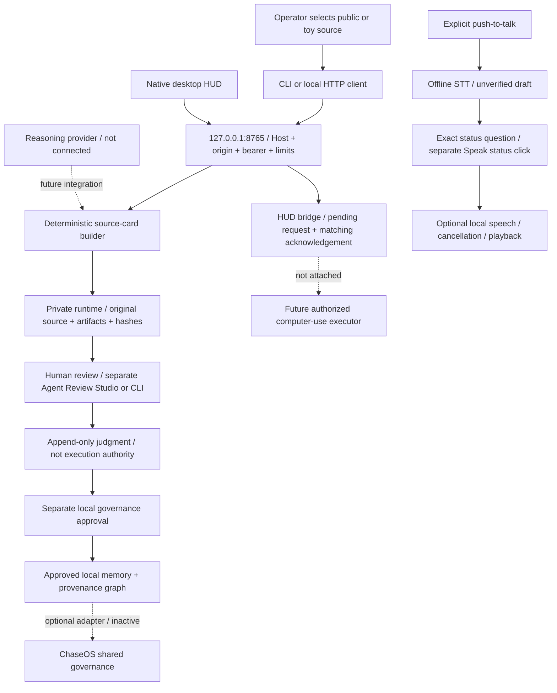

# Local runtime architecture — 27 September 2026

The [conversational companion research programme](../research/2026-09-27-conversational-harness-roadmap.md) defines the next integration: goals, human questions, bounded reasoning, harness adapters, voice and computer use. It is a research-informed plan, not a claim that those adapters are connected.

[Open the offline interactive layer explorer](Runtime-Architecture.html). It needs no server, account, model or network connection. The website version is explanatory documentation, not a remotely hosted agent.

## Current implementation

The approved private-runtime repair and token rotation passed. A real process on `127.0.0.1:8765` created and retrieved a public/toy review run with verified integrity. Missing authorization returned 401; an untrusted origin returned 403; a HUD control request without an executor returned 409. This is local engineering evidence, not a public release or a complete autonomous agent.

Solid arrows describe implemented paths; dashed arrows are incomplete integrations. The HTTP API itself does not accept judgments or promote memory. The read-only speech status path is not general conversation or voice-to-action.

## All 18 responsibilities

| Layer | Responsibility | Engineering status |
|---|---|---|
| 0 | Behaviour contract | Executable deterministic assertions; human acceptance pending |
| 1 | Human operator | Review records and CLI writeback |
| 2 | Interfaces | CLI, native HUD, separate Agent Review Studio; optional ChaseOS Studio |
| 3 | Capture / intake | Local-file and bounded public/toy HTTP intake |
| 4 | Source package | Source, artifacts and per-run integrity records |
| 5 | Workspace / collection | Core scopes/tags; runtime project lifecycle incomplete |
| 6 | Retrieval / evidence | SQLite lexical and filtered retrieval; no semantic RAG |
| 7 | Summary intelligence | Deterministic workflow profiles; no model reasoning |
| 8 | Memory consolidation | Reviewed lifecycle and separate governed promotion |
| 9 | Knowledge / provenance | Local nodes, edges and trace queries |
| 10 | Runtime / orchestration | Local server lifecycle; no autonomous task loop |
| 11 | Evaluation harness | Contract/smoke checks and human-review artifacts |
| 12 | Provider routing | Reasoning provider not connected |
| 13 | Tool / MCP | Executable tool registry not connected |
| 14 | Computer use | HUD protocol tested; real executor not connected |
| 15 | Runtime repair | No durable task crash recovery |
| 16 | Governance | Local approval policy and transport/storage gates |
| 17 | Extensions | Skill review packet; no automatic apply |

The explorer adds each layer's purpose, fundamentals, code reference and next proof requirement. Layer 0 plus the 17 runtime responsibilities explains the earlier 17/18 naming; no extra layer was silently added.

## Next integration sequence

1. Connect a narrow read-only tool to a versioned capability grant; test denial outside its scope.
2. Connect a bounded real executor to HUD pause, stop and take-over, proving acknowledgements against real work.
3. Add a reasoning-provider adapter with bounded budgets and explicit data policy; keep generated intent distinct from permission.
4. Verify microphone, cancellation and audible output with the operator, then extend from status speech to reviewed conversational tasks.
5. Run the operator's accepted case studies as regression targets. Engineering tests never substitute for those judgments.

See [HTTP interface and threat model](../05_Runtime_Adapters/Chaser-Agent-Local-HTTP.md), [as-built map](Chaser-Agent-As-Built-Map.md), and [repair/live-test receipt](../../logs/build/2026-09-27-runtime-activation.md).
