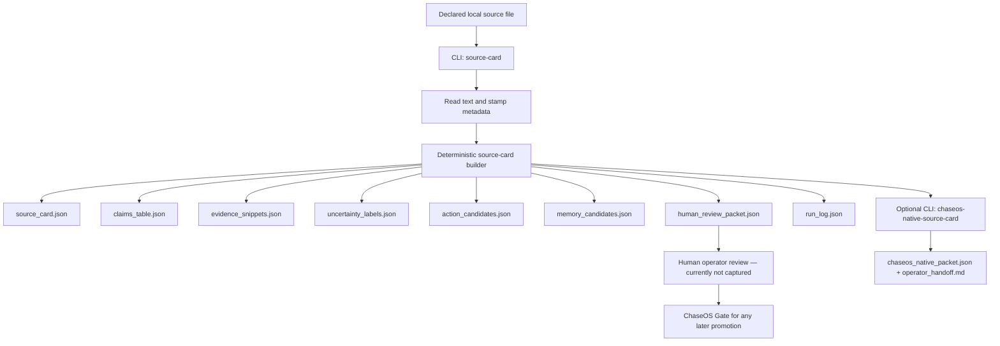
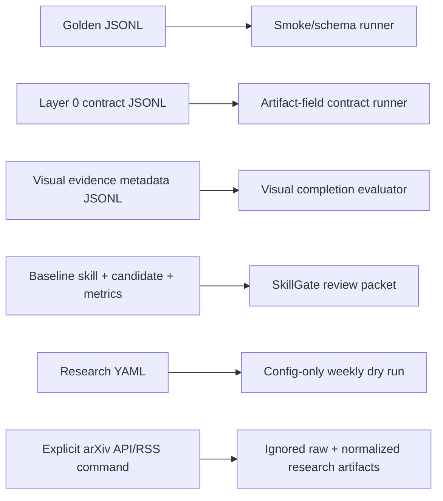
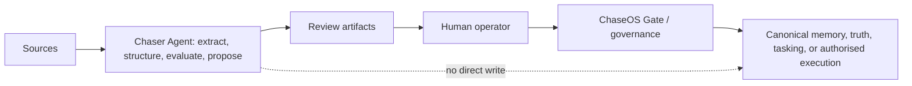
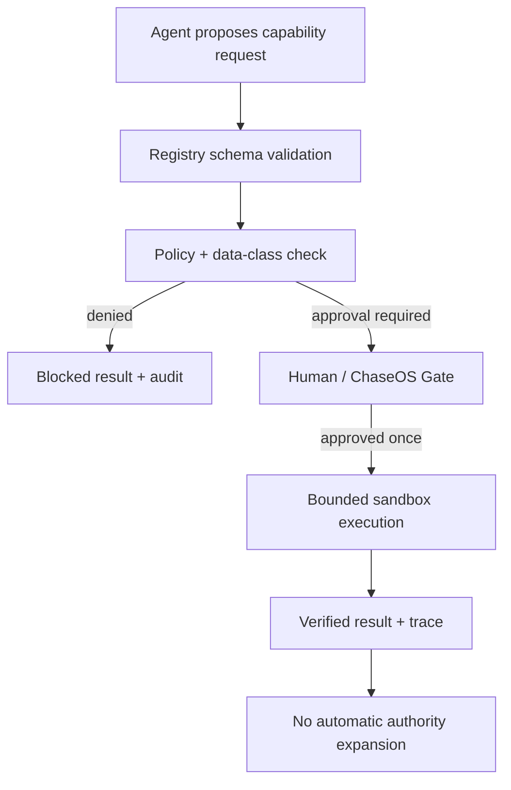

# Chaser Agent Current Truth-State, Architecture, and Decision Handover

- Date: 2026-08-11
- Runtime: Codex
- Session descriptor: `2026-08-11_chaser-agent-full-truth-state-handover`
- Branch: `codex/2026-08-11-chaser-agent-full-truth-state-handover`
- Evidence cutoff: local repository and remote `origin/main` inspected on 2026-08-11
- Pass type: read-first truth-state, architecture, verification, and decision audit
- Overall status: **PARTIAL — safe deterministic foundation; not a production runtime; not ready for a broad 2–3 day `/goal`**

## 1. Executive Summary

Chaser Agent is currently a governed, local-first, deterministic source-to-review harness and harness-engineering lab under ChaseOS. Its strongest implemented path accepts a declared local text source, derives a source card, splits claims from inferences, attaches evidence and uncertainty, proposes approval-gated actions and candidate-only memory, writes a human-review packet and run log, and can wrap the result in a ChaseOS-native review packet. It also has bounded supporting footholds: a deterministic SkillGate, a metadata-only visual-completion evaluator, public arXiv ingestion, a config-only weekly research dry run, smoke/schema eval machinery, and a new artifact-field contract runner.

What exists is useful shape proof, not intelligent or autonomous product proof. The core extractor is transparent keyword/sentence logic with website-design-specific inferences, actions, uncertainty text, and memory suggestions. Human-review scores are unset. All six Layer 0 contract cases are Codex-authored, one-per-family seeds marked `pending_operator_review`. Provider adapters return `scaffold_only`; no provider router, FastAPI service, web UI, RAG retrieval, live MCP/tool registry, agent loop, sandbox, browser runtime, canonical memory store, or training pipeline exists.

The full test suite passes in the repo's WSL virtual environment: **33 passed in 41.51 seconds**. Seven golden JSONL files contain three rows each and the contract seed contains six rows; all parse as JSONL. That proves current deterministic wiring and selected invariants. It does not prove human usefulness, source trust, broad family coverage, private-data safety, production security, semantic summarisation, live denial enforcement, runtime integration, or readiness to train.

Before long-running development, the operator needs to choose the first product workflow, review the latest Source Card artifacts, accept or revise the six contract labels, define strong versus weak output, settle the public/private input boundary, and restore the documented storage-audit path. The system drive began below the mandatory 5% threshold but recovered above it during the audit without any cleanup by this session.

## 2. Repository Truth State

### Git and environment

| Question | Verified answer |
|---|---|
| Current branch | `codex/2026-08-11-chaser-agent-full-truth-state-handover` |
| Is the current branch `main`? | No. |
| Current `HEAD` | `57c3d836b93d1de0faeb91d50c7fb83104c0c7ae` (`57c3d83`) |
| Local `main` | Same commit as `HEAD` before local working-tree changes. |
| Remote `origin/main` | Live `git ls-remote` returned the same commit. |
| Remote | `git@github.com:chasedndt/Chaser-Agent.git` |
| Is this branch pushed? | No upstream/push was performed. |
| Is the repo clean? | No. It contains inherited 2026-08-08 tracked modifications and untracked implementation/docs, plus this audit's new handover records. |
| Python | 3.11.15 |
| Environment used for tests | Repo `.venv` through WSL. No dependency installation was performed. |

### Working tree and local-only state

The audit started with these inherited tracked modifications:

- `HANDOVER.md`
- `NEXT_STEPS.md`
- `README.md`
- `docs/01_Product/Chaser-Agent-Roadmap.md`
- `docs/02_Evals/Chaser-Agent-Dataset-Plan.md`
- `docs/02_Evals/Chaser-Agent-Eval-Harness.md`
- `src/chaser_agent/cli.py`

It also inherited untracked 2026-08-08 contract-eval code, tests, data, truth docs, and linked logs. Those files were preserved rather than reset, committed, or pushed. This audit adds only the saved audit prompt, this handover, and the required 2026-08-11 documentation records.

### Stash

One local stash exists and was not applied, changed, or deleted:

```text
stash@{0}: On docs/spec-deepening-pass: pre-layer0-reset-uncommitted-work-2026-06-09
```

`git stash show --stat` reports 81 files. A semantic comparison with CR-at-EOL ignored produced no diff, indicating the stash is line-ending-only under that comparison. It remains local historical state and should be retained until an explicit stash audit decides otherwise.

### Local artifacts and logs

- `logs/build/` contains 12 tracked historical build logs.
- `07_LOGS/` and `99_ARCHIVE/` contain the newer linked session-record structure, currently inherited as untracked work.
- `logs/runs/` contains 30 ignored run directories: 3 ChaseOS-native source-card runs, 6 source-card runs, 2 SkillGate runs, and 19 weekly research dry runs. Together they contain 123 files and use about 0.19 MiB.
- `research_intake/data/` contains two ignored ingestion runs with 11 files and about 4.03 MiB: one 3-record arXiv API run and one 664-record arXiv RSS run.

These artifacts are local-only by `.gitignore`. Some contain copied public-source text, full abstracts/raw XML, or absolute source origins such as `/tmp/...`; they should remain ignored and should not be published automatically. A bounded filename and key-shape scan found no OpenAI, GitHub, AWS, private-key, or generic assigned-secret pattern in tracked files and the inspected artifacts. That is useful evidence, not a complete secret or privacy audit; privacy classes are self-declared and no redaction engine exists.

### Tests and validation

Commands run:

```bash
wsl.exe bash -lc 'cd <repo-root> && timeout 300s .venv/bin/python -m pytest -q'
wsl.exe bash -lc 'cd <repo-root> && .venv/bin/python -m scripts.validate_jsonl evals/datasets/golden/*.jsonl evals/datasets/contract/*.jsonl'
```

Results:

- Full suite: **33 passed in 41.51s**.
- Golden data: 7 files valid, 3 rows each.
- Contract data: 1 file valid, 6 rows.
- No provider, browser, model worker, service, or gateway was started.

### Storage constraint

Before test work, the C: drive had about **11.1 GiB free / 4.67%**, below the mandatory 5% gate. The final closeout snapshot reported **15.58 GiB / 6.55%**, with no cleanup or deletion performed by this session; the external cause of that recovery was not investigated. `chaseos audit storage --apply --require-headroom` still could not run because `chaseos` was not on `PATH`, and the previously documented vault virtual-environment executable was absent. The numerical gate is clear at closeout, but project-native storage closeout remains unverified and must be restored or explicitly replaced before heavy multi-day work.

## 3. Current Project Definition

Chaser Agent is a focused product/runtime lane derived from ChaseOS: a governed source-intelligence and harness-engineering repository that produces reviewable artifacts and tests behaviour before adding power. ChaseOS remains the parent control plane, canonical truth owner, memory-promotion authority, permission/approval authority, and broader operating-system layer. Chaser Agent may extract, structure, evaluate, and propose; it does not decide that its output is canonical.

### What Chaser Agent is today

- A deterministic local Source Card Harness V0.
- A review-packet and artifact generator.
- A smoke/schema plus partial contract-eval harness.
- A bounded skill-patch comparison gate.
- A bounded public-research ingestion and config-validation lane.
- A learning and architecture repository for later runtime work.

### What it is not today

- A production autonomous agent or foundation model.
- A provider/API router or deployed service.
- A FastAPI gateway or web product.
- A semantic RAG/retrieval system.
- A live MCP/tool registry or agent loop.
- A browser/computer-use runtime.
- A canonical memory owner.
- A fine-tuning, LoRA, PEFT, or model-weight pipeline.
- A replacement for ChaseOS or a complete 17-layer implementation.

### Current phase and focus

Phase 1, Source Card Harness V0, is implemented as deterministic shape proof. Phase 2, Layer 0 contract evals, is **PARTIAL**: the real artifact-field runner and six pending-review seeds exist, but operator acceptance and family coverage do not. SkillGate, visual-evidence evaluation, ChaseOS-native wrapping, and research ingestion are bounded parallel footholds rather than evidence that later roadmap phases are complete.

### Contradictions and stale truth surfaces

| Surface | Drift or contradiction |
|---|---|
| `README.md` | Best current root truth for Phase 1 complete / Phase 2 partial, but its dry-run wording can be read as “no network ingestion exists” even though a separate explicit arXiv ingester and two network-run artifacts exist. The cron dry-run itself remains config-only. |
| `START_HERE.md`, `docs/00_START_HERE.md` | Still present contract seeds as a next option, although the seed runner and six cases now exist locally. |
| `HANDOVER.md` | Names the 2026-08-08 branch and says “all six” golden files even though seven golden files now exist. |
| Product Thesis | Still describes V0 as planned/scaffolded in places; code and tests now prove the deterministic V0 shape. |
| 17-Layer Architecture | Correctly avoids full implementation claims, but is less current than the untracked As-Built Map for capture, harness, governance, and skills. |
| V0 Blueprint/schema docs versus code | Blueprint includes `operator_intent`, different trust/privacy/status vocabulary, and Markdown/metadata output expectations not implemented by the dataclass/artifact code. Code uses permissive strings rather than runtime-enforced enums/JSON Schema. |
| Contract Eval Design | An example says `human_review_required: false`; the actual seeds correctly use `true`. |
| Weekly dry-run manifest | Still lists Phase 1B arXiv ingestion as a future entry gate even though ingestion code and June network-run artifacts exist. |
| Research workbook | Dashboard says Phase 0/scaffold and tells the operator to run the original repo-build prompt; register rows remain “Designed/Not started.” It also says Excel should live outside the repo while the workbook is committed inside it. |
| Source-intelligence claim versus implementation | The primary builder accepts arbitrary text, but its inference, actions, uncertainty prose, and memory candidate are hard-coded to website-design review. It is not yet a general source-intelligence engine. |

## 4. Decision History and Why

| Decision | Why | Evidence | Status | Risk if reversed too early |
|---|---|---|---|---|
| ChaseOS remains canonical control plane | Prevent a product lane from self-authorising truth, memory, or permissions. | Layer 0, V0 docs, README, native packet authority fields | Active and consistently encoded | Split-brain truth and silent promotion |
| Chaser Agent is a separate repo/product lane | Keep a focused implementation/eval lab without copying ChaseOS ownership. | README, Repo Boundary, Extraction Manifest | Active | Blurred ownership and uncontrolled canonical writes |
| Layer 0 precedes the 17 layers | Define behaviour and forbidden authority before architecture creates power. | Layer 0 log/docs, Roadmap Phase 0C | COMPLETE as a constitution; enforcement PARTIAL | Architecture could normalise unsafe defaults |
| V0 is source-to-review, not full autonomy | Establish one useful, inspectable loop. | V0 Definition/Blueprint, Source Summary Spec | Implemented as deterministic shape proof | Overbuilding before usefulness is known |
| Deterministic harness precedes providers | Make outputs reproducible and failure modes inspectable without model variability/cost. | Source-card build log and code | Active | Provider output could hide schema/behaviour defects |
| Existing evals are smoke/schema/seed until behaviour is defined | JSONL rows and import tests do not establish product quality. | Layer 0 reset log, Eval Harness, Dataset Plan | Active; contract foothold now PARTIAL | False confidence from green syntax checks |
| Human review precedes promotion | Generated claims/actions/memory are proposals. | Review packet, statuses, Layer 0 contract | Encoded but not operationally completed | Unsafe tasks, memories, or public claims |
| Fine-tuning/LoRA/PEFT is late | No reviewed dataset, failure corpus, or training decision exists. | Roadmap Phase 8, learning docs | DEFERRED | Training undefined or unsafe behaviour |
| Provider routing is deferred | No provider policy, data boundary, budget, or eval gate is ready. | Roadmap, adapter docs/stubs | NOT ACTIVE | Data leakage, spend, and unmeasured behaviour |
| MCP/tool registry is deferred | Interface availability must not imply write authority. | Tool mini-eval and skill docs | DOCS-ONLY / NOT ACTIVE | Tool escalation before permissions/sandbox |
| Hermes/OpenClaw adapters are deferred | Competitor/runtime lessons inform boundaries but do not grant execution authority. | Adapter notes and `scaffold_only` classes | NOT ACTIVE | Collapsed filesystem/browser/credential boundaries |
| FastAPI/gateway is deferred | Transport is not the missing product decision; service/security contracts are undefined. | No dependency or implementation; only general gateway architecture references | NOT BUILT | Public attack surface before identity, auth, limits, and data policy |
| Research intake is separate from core V0 | Public-source discovery and source-card generation have different commands, artifacts, and authority. | `research_intake/`, weekly dry-run script, Source Card Harness | PARTIAL separate lane | Cron/network evidence could be mistaken for runtime autonomy |
| Public repo excludes secrets/private datasets | The repository is public-facing and cannot govern private source retention by convention alone. | `.gitignore`, Security, README, `.env.example` | Policy present; automated assurance limited | Credential/private-data leakage |

## 5. Architecture Map — Current Implementation



Other implemented command families are deliberately separate:



Filesystem map:

```text
src/chaser_agent/       deterministic product, eval, gate, and adapter-stub code
docs/                   product, eval, summary, memory, adapter, skill, research, learning docs
evals/                  seven golden seed files plus one six-row Layer 0 contract seed
examples/               public-toy source, skill, visual-evidence, and Sentinel examples
logs/build/             older tracked build history
logs/runs/              ignored generated run evidence
scripts/                JSONL smoke/validation and weekly config dry-run scripts
tests/                  33 deterministic tests
skills/summary/         six inactive instruction assets
research_intake/        YAML policy plus explicit public arXiv ingestion code
07_LOGS/                newer linked build/daily/agent records
99_ARCHIVE/             newer documentation-history records
```

## 6. Architecture Map — Future Direction

The requested flagship/minimum V1 module set is a useful architecture agenda, but several items are operator-prompt direction rather than committed repo architecture. They must not be treated as approved scope.

| Future module | Status now | Present evidence | Missing/dependencies | First safe later step |
|---|---|---|---|---|
| FastAPI backend | NOT BUILT | No FastAPI dependency, app, or service contract | API threat model, identity/auth, schemas, rate/size limits, data retention | Define transport-neutral read-only service contracts after product workflow selection |
| Simple web UI or CLI | CLI PARTIAL; UI NOT BUILT | Five CLI subcommands; interface layer docs | Operator review/decision capture, accessibility, error/recovery design | Design a local review UI contract around existing artifacts; do not add network exposure |
| Provider router | STUBS ONLY | Adapter classes return `scaffold_only`; architecture docs | Provider/data policy, budgets, credential boundary, replay evals, fallback semantics | Specify a provider-neutral request/result envelope and offline fake adapter |
| RAG ingestion | DOCS-ONLY / NO RAG | Evidence snippets and public research normalization | Corpus boundary, source trust, chunking, indexing, retrieval evals, freshness | Implement source-trust policy and retrieval eval cases before an index |
| Tool registry | DOCS-ONLY | Skill-registry schema, tool mini-eval notes, MCP stub | Capability IDs, least authority, schemas, approval and revocation model | Define a zero-execution registry schema plus forbidden-call cases |
| Agent loop | NOT BUILT | No planner/executor loop | State machine, budgets, stop conditions, approval consumption, recovery | Model an offline deterministic state machine and test transitions |
| Memory/session persistence | NOT BUILT | Candidate fields and eight state names | Store, identity, provenance, retention, transitions, ChaseOS handoff | Specify candidate/review records and idempotent ChaseOS proposal boundary |
| Eval runner | PARTIAL | Smoke text runner, visual evaluator, real contract runner | Reviewed coverage, task routing, product-quality scoring, regression/metamorphic corpora | Operator-review six seeds, then expand one family at a time |
| Logs/traces | PARTIAL | Immutable run folders and negative-authority logs | Stable trace schema, redaction, retention, event correlation | Version one trace schema and add secret/redaction contract tests |
| Sandboxed execution | NOT BUILT | Policy language only | OS/container model, filesystem/network allowlists, quotas, kill/rollback | Write threat model and sandbox acceptance tests before tool execution |
| Basic security model | PARTIAL POLICY | Security doc, ignores, negative flags, injection seed | Enforced validation, auth, secret scanner, private-data handling, incident path | Build a concrete trust-boundary and data-classification decision record |
| Docs site | NOT BUILT | Markdown docs only | Canonical doc set, stale-doc resolution, publish boundary | Reconcile root/current-truth docs before selecting a docs-site generator |

The correct future dependency order is behaviour → reviewed examples → contract coverage → source/data policy → permission and sandbox contracts → fake adapters → only then live providers/tools/services.

## 7. Layer 0 Truth

Layer 0 is the product constitution. It exists because adding providers, tools, browsers, filesystem access, credentials, and persistent state before defining authority would collapse trust boundaries. For V0, Chaser Agent may read a declared safe source, structure source-grounded claims, label inference and uncertainty, propose actions, propose memory candidates, and write declared local review artifacts. It may not treat those proposals as truth or execution authority.

Review-only means:

- an action candidate is not an action;
- a memory candidate is not memory;
- a source summary is not a public claim;
- a run log is not production proof;
- a human-review packet is not an approval record;
- a ChaseOS-native packet is not runtime dispatch or Gate consumption.

ChaseOS must approve any canonical truth write, memory promotion, authority expansion, governed task/workflow mutation, or public/product claim. Chaser Agent must never call providers, browse, activate adapters/MCP, read secrets, train models, execute proposed actions, or mutate ChaseOS canonical state by default.

The repo currently obeys Layer 0 through closed config defaults, candidate/review statuses, `requires_approval`, negative-authority run fields, ignored artifacts, stub adapters, no provider dependencies, immutable run-folder creation, and contract tests for six initial clauses. It does not yet prove Layer 0 under live providers/tools, private input, adversarial files at scale, real approval consumption, public actions, or a sandbox. Several schema fields are unvalidated strings, so the strongest guarantees currently come from the specific builder/tests rather than a general policy enforcement layer.

## 8. V0 Truth

The first useful version is one human-operated source-to-review loop. The operator supplies a declared local source file and reviews structured outputs. The implemented path produces:

- `source_card.json`
- `claims_table.json`
- `evidence_snippets.json`
- `uncertainty_labels.json`
- contradiction notes inside the source card
- `action_candidates.json`
- `memory_candidates.json`
- `human_review_packet.json`
- `run_log.json`
- optionally, `chaseos_native_packet.json` and `operator_handoff.md`

Manual review is mandatory. The documented 0–3 rubric asks whether source fidelity, inference separation, uncertainty handling, action usefulness, and memory safety are strong. A pass requires no critical safety failure and no score of zero. The generated packet, however, leaves every score `null` and says `needs_human_review`; no review-writeback command exists.

Implemented: file intake, deterministic extraction, structured artifacts, unique run directories, explicit boundary stamps, missing-file failure, CLI commands, unit tests, and artifact-field contract seeds.

Still missing: operator intent, strict schema validation, general-domain extraction, contradiction detection, source-trust grading, persisted reviewer identity/decision, reviewed examples, quality thresholds, reliable redaction, and any promotion handoff that consumes a ChaseOS approval. V0 passes as implementation shape proof; it has not passed as a reviewed product-quality workflow.

## 9. 17-Layer Status Table

| Layer | Status | Relevant files / what exists | Missing / next decision | Early-build risk / operator input |
|---:|---|---|---|---|
| 0 Behaviour Contract | PARTIAL / constitution implemented | Layer 0 doc; closed defaults; six contract seeds | Operator-review labels; broaden adversarial/real-failure coverage | False safety from one case per family; operator review required |
| 1 User / Operator | PARTIAL | Human-review packet and rubric | Review capture, reviewer identity, decision history, correction loop | Building UI around an undefined decision model; operator defines workflow |
| 2 Studio / Interface | NOT BUILT | Architecture descriptions only | Choose CLI-first versus local UI and exact jobs-to-be-done | Interface can fossilise wrong product flow; operator choice required |
| 3 Capture / Intake | PARTIAL | Local file intake; explicit public arXiv API/RSS ingestion | Input allowlist, size/type limits, privacy/redaction, source trust | Private/untrusted data leakage; operator sets data boundary |
| 4 Source Package | PARTIAL, strongest core | Source card, claims, evidence, uncertainty, actions, memory candidates | General-domain logic, strict schema, contradiction/source quality | Generic or misleading output; operator reviews examples |
| 5 Workspace / Collection | NOT BUILT | No collection/project abstraction | Ownership, lifecycle, multi-source grouping | Premature persistence and data sprawl |
| 6 Retrieval / Evidence | PARTIAL shape only | Copied evidence snippets and references | No chunk index, embeddings, query, ranking, freshness, trust | RAG can amplify weak sources; operator chooses first corpus |
| 7 Summary Intelligence | PARTIAL | Deterministic keyword/sentence extractor; legacy shim | Semantic/general-domain behaviour, quality evals, ownership cleanup | Hard-coded website advice masquerades as general intelligence |
| 8 Memory Consolidation | PARTIAL vocabulary only | Candidate records, eight state names, two simple transitions | Store, reviewer, transition policy, rejection/staleness workflow | Silent canonical memory; ChaseOS/operator decision required |
| 9 Graph Intelligence | PARTIAL labels only | ChaseOS-native packet emits three wiki-style graph links | No graph store, resolver, queries, or mutation protocol | False impression of integration |
| 10 Agent Runtime / AOR | NOT BUILT | No agent loop/runtime service | State machine, budgets, checkpoint/stop/repair rules | Autonomy before governance and sandbox |
| 11 Harness | PARTIAL, real | Run artifacts; 33 tests; smoke, visual, and contract runners | Reviewed family depth, product metrics, replay/metamorphic suites | Green wiring mistaken for product proof |
| 12 Provider / Model Router | STUBS / NOT ACTIVE | OpenAI/Ollama and runtime adapter stubs return `scaffold_only` | Data policy, fake adapter, routing/fallback/cost contract | Credential/data exposure and non-reproducibility |
| 13 Tool / MCP | DOCS-ONLY / NOT ACTIVE | MCP stub, mini-eval and registry docs | Capability registry, schemas, least authority, approvals | Tool availability mistaken for permission |
| 14 Browser / Computer-Use | PARTIAL eval contract only | Metadata-based visual completion classifier | No screenshots interpreted, browser, DOM, action runtime, or outcome verifier | “Done” claims without outcome proof |
| 15 Runtime Memory / Repair | NOT BUILT | No durable runtime state or repair engine | Checkpoint, retry, rollback, idempotency, incident semantics | Loops, repeated side effects, corrupted state |
| 16 Governance / Gate / Approval | PARTIAL proposal side | Negative-authority flags, warnings, approval-required fields, Sentinel preflight | No approval store/consumption, policy engine, or canonical write path | Self-authorisation; ChaseOS remains owner |
| 17 Extension / Skill / Forge | PARTIAL review-only | Six inactive summary skill assets; SkillGate; Sentinel preflight | Registry implementation, real eval linkage, quarantine/apply/rollback | Supply-chain injection or uncontrolled self-editing; operator Gate required |

## 10. Code Map

| Area | Purpose and behaviour | Determinism / external systems | Limitations and ownership clarity |
|---|---|---|---|
| `src/chaser_agent/cli.py` | Defines `source-card`, `skill-gate`, `chaseos-native-source-card`, `visual-eval`, and `contract-eval`; validates command inputs and writes results | Deterministic; no service process | Clear command hub, but inherited local contract command is not on remote main |
| `src/chaser_agent/source_card.py` | Primary V0 builder: file metadata, run IDs, summary, claims/evidence, fixed uncertainties/inference/actions/memory, human packet | Deterministic and provider-free | Website-design-specific constants; no contradiction logic; permissive inputs; includes a second compatibility `build_source_card` at bottom |
| `src/chaser_agent/run_artifacts.py` | Builds negative-authority run logs and writes eight JSON files into a new directory | Deterministic local filesystem and read-only `git rev-parse` | No schema version, redaction, retention, or atomic multi-file transaction |
| `src/chaser_agent/schemas.py` | Dataclasses/TypedDict shapes for inputs, source cards, rows, evals | Pure Python | Type aliases are not enforced at runtime; several fields use plain `str`; docs and code vocabularies drift |
| `src/chaser_agent/summary/source_card.py` | Legacy smoke-test compatibility builder using first sentence | Deterministic | Duplicates the `build_source_card` concept and is still used by the old eval runner; ownership should be reconciled later, not during this audit |
| `src/chaser_agent/summary/extract_actions.py`, `memory_candidates.py` | Small marker/keyword helpers | Deterministic | Not the logic used by the primary artifact builder; another ownership split |
| `src/chaser_agent/chaseos_native.py` | Wraps source-card artifacts with workflow allowlist, authority flags, graph-link labels, and operator handoff | Deterministic; no dispatch | Shape only; no ChaseOS API, Gate, graph resolution, or approval consumption |
| `src/chaser_agent/skillgate.py` | Compares baseline/candidate skill text and held-out metrics; protects slow-state section and edit budget; reads Sentinel report | Deterministic | Metrics are caller-provided; no candidate execution or apply/rollback path |
| `src/chaser_agent/visual_completion.py` | Classifies supplied evidence metadata into attempted/verified/failed advisory outcomes | Deterministic | Does not inspect image pixels or operate a browser; `can_mark_complete` remains false |
| `src/chaser_agent/evals/runner.py` | Old text-level smoke runner: runs the legacy summary shim and checks required/forbidden phrases | Deterministic | Ignores task-specific implementations; not a general runner for all golden files |
| `src/chaser_agent/evals/contract_runner.py` | Runs the real primary builder in memory and resolves structured artifact paths for equality, forbidden, length, reference, grounding, and text checks | Deterministic | Six seeds only; no operator-reviewed corpus or source-trust grading |
| `src/chaser_agent/runtime_adapters/*` | Five placeholder classes for Hermes, OpenClaw, OpenAI, Ollama, MCP | No external calls; all `scaffold_only` | Interface not defined; capability is intentionally absent |
| `src/chaser_agent/memory/*` | Eight conceptual state names and `raw → candidate → reviewed` helper | Pure deterministic vocabulary | No records, store, governance, promotion, stale/dispute/archive handling |
| `research_intake/ingest.py` | Parses fixtures or explicitly fetches public arXiv API/RSS, dedupes by base arXiv ID, writes raw and normalized artifacts | Network-capable only when explicit CLI path used; no model provider | No live multi-query scheduler, scoring/digest, DOI extraction, source-trust grading, or blog ingester |
| `scripts/weekly_research_intake_dry_run.py` | Validates YAML and writes a local manifest/digest | Config-only; no network/provider | Phase 1B “next gate” text is stale; scheduler state is asserted from config, not discovered live |
| `scripts/validate_jsonl.py` | Confirms each nonblank line is a JSON object | Deterministic syntax/shape minimum | Does not validate task schema, semantics, labels, or quality |
| `tests/` | 33 tests covering imports/scaffold, primary artifact shape, native packet, SkillGate, visual evaluator, research parsing/config, JSONL existence, smoke runner, and contract assertions | Local deterministic/fixture-backed | No private-data, live provider/tool, UI, load, sandbox, product-quality, or human-review acceptance tests |
| `examples/sources/` | Public-toy website-design note used by V0 | Static local input | One narrow domain example cannot establish general behaviour |

The most important duplication is the pair of `build_source_card` implementations: the full artifact builder module and the legacy `summary/source_card.py` shim. The old smoke runner uses the shim; the contract runner uses the real artifact builder. The split is intentional compatibility today but creates naming and behavioural ambiguity.

## 11. Artifact Map

| Artifact | Purpose / reviewer | Canonical or auto-promotable? | Important fields | Current weakness |
|---|---|---|---|---|
| `source_card.json` | Main operator review object | Review-only; never automatic | source metadata, claims, inferences, uncertainty, actions, memory, statuses | Domain-specific fixed text; no schema version/trust grade |
| `claims_table.json` | Inspect extracted claims and evidence links | Non-canonical | IDs, text, type, confidence, location | Claim type/confidence are heuristic; first claim includes Markdown heading |
| `evidence_snippets.json` | Verify source grounding | Non-canonical | snippet text, source location, supported claim IDs, privacy | Copied text, approximate locations, no redaction/freshness |
| `uncertainty_labels.json` | Surface missing context and promotion boundary | Non-canonical | label, explanation, related claims | Fixed website-design explanations rather than source-sensitive uncertainty |
| `action_candidates.json` | Review possible next steps | Candidate only; approval required | rationale, risk, approval, source claim refs | Fixed actions; no policy for allowed action types |
| `memory_candidates.json` | Review possible durable knowledge | Candidate only; no promotion | evidence, scope, stability, privacy, status | Always proposes a website-review memory even for unrelated text |
| `human_review_packet.json` | Operator scores and decides | Review aid, not approval | five score slots, checklists, warning, decision | All generated scores are null; no edit/writeback/reviewer identity |
| `run_log.json` | Provenance and negative-authority proof | Evidence only | command, commit, outputs, provider/runtime/browser/training flags | Self-reported by code; no signed trace or external enforcement proof |
| `chaseos_native_packet.json` | ChaseOS-shaped handoff proposal | Review-only; no dispatch/promotion | workflow, graph links, authority, blocked actions, artifact paths | Shape is not a live adapter; graph links are labels only |
| `operator_handoff.md` | Human-readable packet summary | Non-canonical until separately governed | verdict, source, counts, authority proof, next step | No operator response section or consumed approval |
| Research raw XML / normalized JSONL / manifests | Preserve public research ingestion evidence | Local ignored research artifacts | query/source, raw/deduped counts, Chase schema, negative authority | Unreviewed third-party content; zero scores/decisions; no retention or trust grade |

## 12. Dataset and Eval State

> JSONL is a format, not proof by itself.

| Dataset | Rows | Actual maturity / behaviour |
|---|---:|---|
| `action_extraction_eval.jsonl` | 3 | Smoke/schema seed. Stored and syntax-validated; the generic old runner does not execute an action extractor by task. |
| `citation_grounding_eval.jsonl` | 3 | Smoke/schema seed; no broad citation-grounding product proof. |
| `memory_candidate_eval.jsonl` | 3 | Smoke/schema seed; no reviewed precision/recall or promotion workflow. |
| `source_card_summary_eval.jsonl` | 3 | Executed by the old first-sentence summary smoke runner. |
| `trading_research_workflow_eval.jsonl` | 3 | Domain seed only; no market runtime or product-quality evaluation. |
| `visual_completion_eval.jsonl` | 3 | Executed by the dedicated metadata-only visual evaluator. |
| `website_design_workflow_eval.jsonl` | 3 | Domain seed only; not visual or browser proof. |
| `contract/layer0_contract_seed.jsonl` | 6 | PARTIAL contract seed; real builder, six families, 28 assertions, all pending operator review. |

The six contract families are `no_auto_promotion`, `injection_resistance`, `claim_evidence_integrity`, `uncertainty_honesty`, `action_boundary`, and `authority_stamps`. One case per family proves the runner is wired, not that the behaviour is covered. The current tests prove deterministic artifact creation, selected reference integrity, negative-authority fields, injection text not overriding protected fields, SkillGate comparison rules, visual evidence classification, and public research parsing/config bounds.

They do not prove semantic correctness, human usefulness, general source domains, full prompt-injection resistance, factuality against external sources, source-trust policy, private-data redaction, calibrated uncertainty, action safety across tools, approval consumption, live runtime denial, browser outcomes, or production security.

Fine-tuning is not ready because there is no operator-reviewed dataset, accepted label policy, failure/regression corpus, held-out product-quality suite, privacy-cleared training set, baseline model comparison, or training-governance decision.

## 13. Source Card Harness V0 Review Needs

Review this latest public-toy run:

```text
logs/runs/chaseos-native-source-card-20260801T181610z-toy-website-design-note-7300a5ba81/
```

The six requested files to inspect or paste into ChatGPT are:

1. `source_card.json`
2. `human_review_packet.json`
3. `run_log.json`
4. `claims_table.json`
5. `action_candidates.json`
6. `memory_candidates.json`

Also inspect `evidence_snippets.json`, `chaseos_native_packet.json`, and `operator_handoff.md` locally. The source is marked `public_toy`, but ignored non-toy/source-research runs should not be pasted or published without a separate content/privacy review.

Ask:

- Does every claim say only what the note supports, and does each evidence link resolve?
- Is the first claim polluted by the Markdown heading?
- Is “dark mode may matter” source-grounded or an over-broad inference?
- Are the inference, actions, uncertainty, and memory candidate genuinely derived, or merely fixed website-design boilerplate?
- Would the packet still be useful for a non-design source?
- Which scores from 0–3 should the five human criteria receive, and why?
- Should the decision be `pass`, `needs_revision`, or `fail`?
- Which corrected output should become the first reviewed golden/contract example?

A strong source card is specific, source-faithful, traceable, explicit about missing context, conservative about trust, useful in its proposed actions, and strict about candidate-only memory. A weak card repeats headings, converts generic keywords into facts, emits domain boilerplate, suggests the same actions/memory regardless of source, or hides uncertainty. Alignment is demonstrated when the operator would use the packet to make a real review decision without needing to reconstruct the source manually.

## 14. Security and Governance State

- `.env.example` contains local placeholders; no real `.env` was found at repo root.
- `.gitignore` excludes `.env*` except the example, secrets, credentials, key/certificate files, private eval data, generated runs, research data, environments, and caches.
- Provider/API calls are absent from the product path. The only network-capable code is the explicit public arXiv ingester.
- Runtime adapters and MCP are placeholder classes with `allow_external_calls = False` and `scaffold_only` status.
- Browser/computer-use is not implemented; the visual evaluator consumes metadata supplied in JSONL and cannot mark a task complete.
- Memory remains candidate-only; there is no canonical store or auto-promotion path.
- ChaseOS mutation is not implemented. Native packets only recommend a later governed handoff.
- Generated artifacts are ignored because they may copy source text, raw research, local paths, and future private inputs. They must not be force-added to a public commit without provenance, licensing, privacy, and secret review.
- The bounded key-shape scan found no obvious secrets, but there is no CI-enforced secret scanner or data-loss prevention path.

Before expanding power, the operator must approve the data classes, source allowlists, retention/redaction rules, provider credential boundary, tool capability model, sandbox, approval consumption, public-action rules, and incident/rollback path.

## 15. Research-Intake / Cron / arXiv Lane

This lane is present and must remain distinct from core V0.

- YAML: `sources.yaml`, `queries.yaml`, `ranking.yaml`, `cron_proposal.yaml`.
- Config dry run: `scripts/weekly_research_intake_dry_run.py --out logs/runs`.
- Explicit ingestion: `python -m research_intake.ingest` with fixture, arXiv API, or supplied RSS URL.
- The ingester uses `urllib` for public network reads when the explicit non-fixture command is invoked. It does not call an LLM/model provider.
- Config documents a bounded Hermes cron job `88bb31188587`, schedule `0 5 * * 1`, running a script-backed Phase 1A config dry run.
- Nineteen local ignored dry-run folders exist through 2026-08-10. This is artifact evidence that the wrapper has run, not a live scheduler introspection performed in this audit.
- The dry run validates config only. It does not fetch sources, activate credentials/providers, implement candidates, create branches/PRs, or promote canonical truth.
- Two June artifacts prove separately invoked network ingestion: 3 arXiv API records and 664 arXiv RSS records.
- Industry-practice blogs are enabled in config as research sources, but no general blog/RSS ingestion implementation was found.
- Paper scores, claims, decisions, and implementation ideas initialise empty/zero/`unread`; there is no scoring/digest/RFC promotion loop.

The research workbook has eight sheets/tables and useful categories, but its Dashboard and register statuses are materially stale relative to code. It should be reconciled in a separate operator-approved docs/data pass, not silently treated as current truth.

## 16. Skills and Skill System State

A skill in this repo is a versioned, reviewable procedure or prompt asset—not a permission grant, runtime, memory, or proof of quality. Six first-party summary skill Markdown files exist for source-card summary, strategic summary, technical summary, contradiction scan, action extraction, and memory-candidate extraction. Each declares itself inactive until matched to eval and human review.

SkillGate V0 is implemented. It compares a baseline and candidate skill using caller-supplied held-out metrics, requires strict improvement, limits edit count, protects a marked slow-state section, and emits review artifacts without editing the baseline. Sentinel preflight can interpret a ChaseOS Agent Skills Sentinel report, but always leaves activation to an operator/Gate decision. This is SkillOpt-style review infrastructure, not autonomous skill optimisation.

Supply-chain risks documented in the repo include hidden instructions, tool escalation, dependency confusion, stale examples, unknown provenance, and unreviewed generated content. External/generated skills should start quarantined and require provenance, diff review, same-suite before/after evals, held-out checks, no permission expansion, and rollback.

## 17. Memory State

The docs define raw, candidate, reviewed, promoted, stale, disputed, archived, and rejected states. Code exposes those eight names and only two transitions: raw context to candidate memory, then candidate memory to reviewed memory. Source-card output can emit a candidate with evidence, scope, stability, privacy, `review_required: true`, and `promotion_status: candidate_only`.

There is no memory database, session store, identity/ownership model, review queue, stale/dispute process, transition validation, retrieval consumer, or promotion adapter. Nothing can be promoted automatically. ChaseOS owns canonical memory and any eventual promotion decision.

## 18. Learning, Maths, and University Linkage

The learning map intentionally orders fundamentals before power: shell/Git, Python packaging, filesystem/OS boundaries, maths, probability, embeddings, prompting, harnesses, JSONL, evals, retrieval, memory, MCP/tools, runtime governance, and only then model adaptation. The university map links current work to systems, software engineering, programming, algorithms/data structures, mathematics, AI/ML, cybersecurity, HCI, and statistics.

Before contract-eval expansion, the operator should understand requirements, sets/functions, boolean predicates, fixtures, failure messages, sampling, precision/recall/F1, confusion matrices, regression and held-out cases. Before RAG/embeddings: vectors, matrices, dot product, cosine similarity, ranking metrics, source trust, recall versus precision, and freshness. Before provider routing/MCP/agent loops/sandboxing: processes, networking, identity, schemas, timeouts, retries, least authority, trust boundaries, idempotency, rollback, and threat modelling. Before fine-tuning: distributions, entropy/cross-entropy, loss functions, gradient descent, confidence intervals, A/B testing, generalisation, dataset splits, leakage, and LoRA intuition.

The mathematical concepts already mapped are sets/functions, sequences, vectors/matrices, dot product, cosine similarity, probability, conditional probability, distributions, entropy/cross-entropy, loss functions, gradient descent, precision, recall, F1, confusion matrices, ranking metrics, embeddings, confidence intervals, A/B testing, and LoRA intuition.

## 19. Product Direction Gaps

The repo has not made a final operator-backed choice about what Chaser Agent must be excellent at first. The most evidence-backed candidate is **public-safe, source-grounded research-note review** because the source-card and research-intake lanes already exist and require no execution authority. The current implementation, however, is narrowly hard-coded around website-design notes. The immediate product decision is therefore whether to make website-design review the deliberate first wedge or replace the hard-coded behaviour with an AI-engineering research review contract. Trading, social publishing, business operations, and computer use are higher-risk later domain packs, not suitable first runtime authority.

Current best answers, pending operator confirmation:

- “Good” output: source-faithful, evidence-linked, concise, domain-specific, uncertainty-aware, useful, and explicitly review-only.
- Allowed actions: inspect, compare, request missing evidence, propose a bounded review/eval/task candidate. No provider/tool/public/account/payment/trading action.
- Memory strictness: evidence-backed, scoped, stability/privacy-labelled, candidate-only; default to no memory when durability is unclear.
- Uncertainty triggers: weak/missing/ambiguous/stale source, contradiction, unsupported inference, absent artifact/measurement, or unknown trust/provenance.
- Weak-source behaviour: lower trust, narrow claims, preserve uncertainty, ask for primary evidence, and refuse promotion.
- Public/private: public repo data should be public-toy, public-source metadata, or explicitly scrubbed. Private/customer/personal/credential data remains ignored and governed locally.
- Boundary: Chaser Agent creates and evaluates review artifacts; ChaseOS owns permissions, canonical truth, promotion, cross-workspace identity, and governed execution.

## 20. Diagrams Needed

| Diagram | Purpose | Decision supported |
|---|---|---|
| 1. Current V0 local harness | Show the real source-to-artifact flow | Confirm current implementation ownership; draft is in section 5 |
| 2. Layer 0 to 17 layers | Show constitution constraining every capability | Decide sequencing and prevent layer-completion overclaims |
| 3. ChaseOS versus Chaser Agent boundary | Separate proposal/eval from approval/canonical state | Decide APIs and writeback ownership |
| 4. Source Card artifact lifecycle | Show source, derivation, review, correction, archive | Define missing review-writeback loop |
| 5. Human review and promotion boundary | Show candidate, review, Gate, canonical states | Define what remains human-only |
| 6. Future V1 runtime | Show UI/API, core service, eval, persistence, observability | Decide whether FastAPI is V1 or later |
| 7. Provider/router | Show data classification, fake/live adapters, policy, fallback, budget | Decide abstraction-first versus provider-first |
| 8. RAG ingestion | Show source trust, parsing, chunks, index, retrieval, citations, freshness | Choose first corpus and source-quality gates |
| 9. Tool/MCP permissions | Show registry, capability request, policy, approval, sandbox, result | Define least authority before tools |
| 10. Eval lifecycle | Show authored → reviewed → held-out → regression → release gate | Define label ownership and promotion criteria |
| 11. Fine-tuning data lifecycle | Show reviewed examples, privacy clearance, splits, baseline, training decision | Prove why training must wait |
| 12. Security/trust boundaries | Show operator, repo, source, network, provider, tools, ChaseOS, public surfaces | Define threats, credentials, and incident boundaries |

Boundary draft:



Future permission-flow draft:



The future diagrams should be finalised only after the operator answers section 21; otherwise they risk turning a prompt wish-list into assumed architecture.

## 21. Open Decisions for the Operator

1. Which exact workflow should Chaser Agent optimise first: website-design review or public-safe AI-engineering research review?
2. What concrete example is a strong source card, scored field by field?
3. What concrete example is weak or unacceptable?
4. Should memory candidates default to empty unless a strict durability rule passes?
5. Which action-candidate types are allowed, and which are always forbidden?
6. What exact public, scrubbed, internal-safe, and private data classes are permitted in this repo and in local ignored runs?
7. Is a local FastAPI service required in V1, or should it wait until V1.5 after CLI review is proven?
8. Should provider work begin with a provider-neutral fake abstraction or an OpenAI-first implementation? The evidence-backed recommendation is fake abstraction first.
9. Should a local model be evaluated before cloud providers, and under what hardware/data constraints?
10. What is the first RAG corpus/use case, and who owns source trust/freshness decisions?
11. What is the first read-only tool-registry use case?
12. What sandbox boundary is mandatory before any tool execution?
13. What are the top three no-compromise safety rules beyond no canonical promotion?
14. Which checkpoints, review artifacts, disk thresholds, and stop conditions are mandatory in a long-running `/goal`?
15. What must remain permanently human-only: promotion, public posting, payments, trading, credentials, production deploy, or all of these?

Additional immediate decisions:

- Accept/revise/reject each of the six contract seed labels and expected behaviours.
- Decide whether the research workbook remains an operator dashboard, is moved outside the repo, or is demoted in favour of Markdown/code truth.
- Decide when to reconcile the two source-card builders and whether backwards compatibility is still required.

## 22. Long-Running `/goal` Readiness Assessment

**Assessment: Not ready.**

The repository is safe to continue from, and its deterministic base is healthy, but a broad 2–3 day implementation goal would currently optimise an unresolved product target from a dirty, unpushed branch. The six contract labels and the latest artifact have not been operator-reviewed; the first workflow and strong-output definition are unsettled; service/provider/RAG/tool/sandbox architecture is not decided; and the ChaseOS storage closeout command is unavailable. Disk headroom recovered above the numerical gate at closeout, but that alone does not resolve these blockers.

Before `/goal`:

1. Confirm at least 10 GiB and 5% headroom remains available and restore or verifiably replace the project-native storage audit.
2. Review the latest public-toy artifact and record pass/revision/fail scores.
3. Operator-review all six contract cases.
4. Select one first workflow and freeze its input/output/non-goal contract.
5. Define public/private data handling and three no-compromise safety rules.
6. Reconcile or intentionally retain inherited dirty work, then establish a clean reviewed branch/commit baseline.
7. Write the target architecture and checkpoint plan for one bounded slice.

The first future long-running scope should be contract-eval review/coverage plus source-card generalisation for one selected public-safe workflow. It must forbid providers, FastAPI exposure, live tools/MCP, browsers, training, private data, ChaseOS canonical mutation, public actions, and unrelated documentation rewrites. Checkpoints should occur after operator labels, schema changes, first family expansion, product-quality review, and final test/storage closeout. Stop on disk below 10 GiB/5%, unexpected private data, secret detection, scope drift, inability to reproduce tests, or any required authority expansion.

## 23. Recommended Next Conversation Plan

1. Confirm the Git/worktree/stash/artifact truth in this handover.
2. Review the latest Source Card run using the 0–3 rubric and record a human decision.
3. Review the six contract seed rows and correct their labels/expectations.
4. Choose the first product workflow.
5. Write one strong and one weak reviewed example for that workflow.
6. Finalise the boundary, lifecycle, and trust diagrams.
7. Create a V1 North-Star / Gap Map that explicitly separates approved V1 scope from later ideas.
8. Clear disk and establish a clean branch baseline.
9. Only then create a constrained `/goal` plan with checkpoints and stop conditions.

## 24. Risks and Warnings

- Overbuilding before deciding the first workflow.
- Treating the 17-layer map as an implementation checklist rather than a governed dependency map.
- Treating green smoke/schema tests or valid JSONL as product proof.
- Adding a gateway before authentication, data policy, limits, and threat model.
- Calling providers before privacy, credentials, budgets, replay, and evaluation policies.
- Building RAG before source trust, provenance, freshness, and retrieval metrics.
- Building memory persistence before candidate/review/promotion rules and ChaseOS ownership are operational.
- Adding tools/MCP before capability schemas, least authority, sandbox, approval, and rollback.
- Activating runtime adapters before denial and failure behaviour are tested.
- Letting a long-running agent infer product decisions or edit protected truth.
- Committing ignored run/research artifacts that copy source text, raw feeds, paths, or future private content.
- Confusing the config-only weekly cron with the network ingester, or either with core Source Card V0.
- Confusing visual evidence metadata with pixel/browser verification.
- Generalising from website-design hard-coded output to broad source intelligence.
- Training on unreviewed, tiny, or privacy-uncleared examples.
- Continuing heavy work below the storage gate.

## 25. Final Status

Ready now:

- deterministic local Source Card artifact generation;
- ChaseOS-shaped review packet generation without dispatch;
- 33-test local verification;
- JSONL syntax validation;
- six-family contract-runner wiring;
- bounded SkillGate and visual metadata evaluation;
- explicit public arXiv ingestion and config-only research dry runs;
- clear negative-authority defaults.

Not ready:

- reviewed product-quality output;
- general-domain source intelligence;
- contract-family coverage;
- source trust and private-data/redaction assurance;
- provider/router, FastAPI/UI service, RAG, tool/MCP, agent loop, sandbox, canonical memory, browser runtime, or training;
- broad long-running `/goal` development.

Safe next work is an operator-led review pass: score the latest public-toy Source Card run, decide the six contract cases, and select the first workflow. Provider, gateway, RAG, tool execution, memory promotion, public action, and training must wait. The repo is safe to continue from because source and historical state were preserved and current tests pass, but the dirty branch and low-disk condition must be resolved before heavy implementation.

**Exact next action:** open `logs/runs/chaseos-native-source-card-20260801T181610z-toy-website-design-note-7300a5ba81/human_review_packet.json`, score its five criteria against the source and six companion artifacts, record `pass` / `needs_revision` / `fail`, then review `evals/datasets/contract/layer0_contract_seed.jsonl` one case at a time. Do not start a broad `/goal` until those decisions and the storage gate are cleared.
