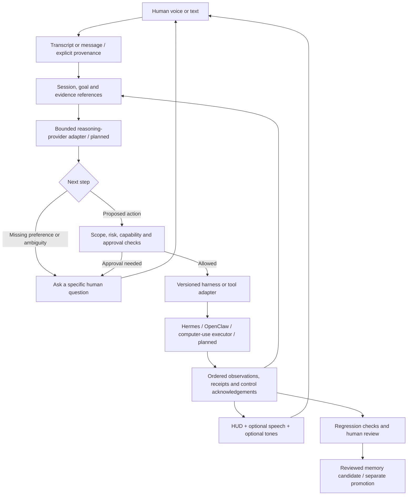

# From a local review harness to a conversational operator

Status: research-informed design, not a completed Jarvis-style agent. The local API, HUD and bounded offline speech interfaces exist. No general reasoning provider, Hermes/OpenClaw adapter or real computer-use executor is connected yet. Gateway account login does not currently start this desktop process.

## The product we are building

One local companion accepts a spoken or typed goal, checks the available context, asks for missing human judgment when necessary, proposes or performs permitted steps, reports what actually happened, and retains reviewable evidence. The HUD can be minimized and restored; it distinguishes listening, thinking, waiting for you, executing, stopping and disconnected states. Optional short tones supplement text, never replace it. Tone preferences, a persistent launcher/tray toggle, account pairing and free-form conversational replies are planned.

The companion coordinates harnesses through explicit adapters. Hermes, OpenClaw and future runtimes retain their identity, permissions and configuration. Prefer supported APIs/CLIs to controlling another agent's chat window with mouse clicks. Computer use is a separate capability for applications without suitable APIs, not a universal integration mechanism.

The reasoning model proposes; deterministic code controls authority, budgets, state transitions and dispatch. A transcript is not an authenticated grant. A harness response and a web page are evidence, not permission. Show concise decision summaries and tool receipts rather than claiming access to a model's private internal reasoning.

## Research to engineering decisions

These are selected foundations, not claims that every paper has been reproduced or that their reported scores transfer to Chaser Agent.

| Source | What we take from it | Our experiment / acceptance test |
|---|---|---|
| [ReAct, Yao et al.](https://arxiv.org/abs/2210.03629) | Interleave planning and observed action results instead of generating a long blind action list. | On a bounded file/browser task, compare a static plan with an observe–act loop under identical model and action budgets. Grade final state, errors and cost. |
| [Reflexion, Shinn et al., v4](https://arxiv.org/html/2303.11366v4) | Feedback can improve later attempts through textual episodic memory without updating model weights. | Compare no memory, raw self-reflection and human-approved lessons on held-out workflow episodes. Reject unsupported or cross-project memory. Reflection is not guaranteed to be correct. |
| [OSWorld, Xie et al.](https://arxiv.org/abs/2404.07972) | Judge computer work by actual environment outcomes, not a convincing completion message. | Run isolated tasks with known initial state and an executable final-state checker; retain the trace and failure evidence. |
| [Windows Agent Arena, Bonatti et al.](https://arxiv.org/html/2409.08264v1) | Use reproducible Windows tasks and environment-based evaluation for this Windows-first product. | Begin in an isolated test environment with harmless app/file tasks. Measure stop acknowledgement, unintended effects, completion and replayability. Never benchmark on the operator's live business accounts. |
| [AgentDojo, Debenedetti et al., v3](https://arxiv.org/abs/2406.13352v3) | Untrusted tool content can redirect an agent; useful-task success and attack resistance must both be measured. | Inject instructions into toy pages/files/tool replies; verify that they cannot widen scope, reveal credentials or turn evidence into authorization. Record benign success separately from attack success. |
| [A2A specification](https://a2a-protocol.org/latest/specification/) | Task IDs, context IDs, capabilities, status updates and cancellation provide useful interoperability concepts. This is a protocol reference, not a research result. | Pin an exact version before implementation. Test one adapter's start/status/cancel/results mapping and reject unsupported capabilities. No A2A compatibility claim until conformance is demonstrated. |

## How a paper becomes a feature

1. Record the paper/version, problem, assumptions, algorithm, environment, baseline, metric and limitations. Read the relevant method and evaluation sections; abstracts alone are insufficient to choose an implementation.
2. State a falsifiable hypothesis for one Chaser workflow. Example: approved episodic lessons reduce repeated source-context failures on held-out tasks without increasing incorrect memory use.
3. Build the smallest reproducible baseline with pinned model/configuration, dataset split, seeds where available and resource budgets. Preserve unknown telemetry as unknown.
4. Change one mechanism; run repeated paired baseline/candidate trials. Track variance, latency, cost and side effects alongside task success. Keep private cases local and publish only redacted or synthetic evidence.
5. Inspect failures. Your business judgments supply reference labels; deterministic final-state checks cover the mechanics. Neither replaces the other.
6. Adopt, revise or reject the feature based on evidence. Update the architecture and regression tests with the exact proof boundary.

This stage is **harness engineering, evaluation and feedback curation**. It is not model-weight fine-tuning or backpropagation. A separate training programme would require licensed data, train/validation/test splits, a training objective, compute budget and held-out evidence that weight updates help.

## Implementation sequence and measurable gates

1. **Local companion shell:** keep port 8765 private; provide HUD minimize/restore and topmost controls; clear/cancel voice on minimization. Build a reliable launcher before account pairing. Current slice implements those window controls, not gateway login integration.
2. **Session and conversation engine:** typed messages first, then explicit voice turns; stable session/turn IDs, bounded context assembly, cancellation and visible questions. Select and pin the first reasoning provider/config. Never promise an unlimited context window: preserve full sources separately and assemble relevant bounded context with provenance.
3. **Human-question protocol:** distinguish missing information, subjective preference and explicit approval. Ask when the answer materially changes the outcome or authority; do not repeatedly ask for routine already-approved engineering. Store answers against the exact question/task/version, not as global permanent permission.
4. **Harness adapters:** capability discovery, authenticated connection, scoped grants, start/status/cancel, ordered events and results. Start with one real adapter. Do not hand one harness another harness's credentials or implicitly delegate permissions.
5. **Computer-use executor:** isolated app scope, real observations, bounded steps, failure recovery and tested stop/take-over. A sent cancel is pending until acknowledged; disconnect means uncertain state. The existing HUD bridge already encodes this distinction.
6. **Conversational voice:** validate real microphone and speaker behaviour, response correctness and interruption latency. Keep the mic indicator visible; no hidden continuous recording. Add opt-in tones only after the state/event semantics are stable.
7. **Personal acceptance:** the operator runs real case studies in Agent Review Studio once the integrated HUD workflow is ready. Engineering continues without inventing those ratings.

## What we must not claim yet

No autonomous Jarvis completion, no reliable generic computer control, no Hermes/OpenClaw control, no A2A conformance, no calibrated model confidence, and no fully trained agent. Public pages must continue to separate shipped local review capabilities from this planned integration.
